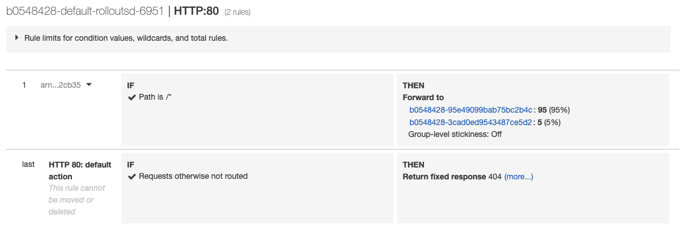

本指南介绍了 Argo Rollouts 如何与 [AWS 负载均衡器控制器](https://kubernetes-sigs.github.io/aws-load-balancer-controller/latest/)集成以进行流量调整。本指南以[基本入门指南](../basic-usage/)的概念为基础。

## 要求

- 安装了 AWS ALB Ingress Controller 的 Kubernetes 集群

🔔 提示：请参阅[负载均衡器控制器安装说明](https://kubernetes-sigs.github.io/aws-load-balancer-controller/latest/deploy/installation/)，了解如何安装 AWS 负载均衡器控制器。

## 1. 部署 Rollout、Services 和 Ingress

当 AWS ALB Ingress 用作流量路由器时，Rollout canary 策略必须定义以下字段：

```yaml
apiVersion: argoproj.io/v1alpha1
kind: Rollout
metadata:
  name: rollouts-demo
spec:
  strategy:
    canary:
      # canaryService 和 stableService 是指向 Rollout 将要修改的 Service 的引用，以便将其定向到金丝雀 ReplicaSet 和稳定 ReplicaSet（必填）。
      canaryService: rollouts-demo-canary
      stableService: rollouts-demo-stable
      trafficRouting:
        alb:
          # 引用的 Ingress 将通过注释操作被注入，以便将 AWS 负载均衡器控制器中的流量分配到金丝雀和稳定 Service 之间，根据所需的流量权重（必填）。
          ingress: rollouts-demo-ingress
          # Ingress 必须在规则中定位到的 Service 的引用（可选）。
          # 如果省略，使用 canary.stableService。
          rootService: rollouts-demo-root
          # Service 端口是 Service 监听的端口（必填）。
          servicePort: 443
...
```

Rollout 引用的 Ingress 必须具有与其中一项 Rollout 服务相匹配的规则。这应该是 `canary.trafficRouting.alb.rootService` （如果指定），否则 Rollout 将使用 `canary.stableService` 。

```yaml
apiVersion: networking.k8s.io/v1beta1
kind: Ingress
metadata:
  name: rollouts-demo-ingress
  annotations:
    kubernetes.io/ingress.class: alb
spec:
  rules:
  - http:
      paths:
      - path: /*
        backend:
          # serviceName 必须匹配以下之一：canary.trafficRouting.alb.rootService（如果指定），
          # 或 canary.stableService（如果省略 rootService）
          serviceName: rollouts-demo-root
          # servicePort 必须是值：use-annotation
          # 这样可以指示 AWS 负载均衡器控制器查看注释以了解如何定向流量
          servicePort: use-annotation
```

在更新期间，Ingress 将被注入一个[自定义动作注释](https://kubernetes-sigs.github.io/aws-load-balancer-controller/latest/guide/ingress/annotations/#actions)，该注释指示 ALB 在稳定版和 Rollout 引用的金丝雀服务之间分割流量。在这个例子中，这些服务的名称分别是：`rollouts-demo-stable`和 `rollouts-demo-canary`。

运行以下命令来部署：

- 一个 Rollout
- 三个服务（root、stable、canary）
- 一个 Ingress

```shell
kubectl apply -f https://raw.githubusercontent.com/argoproj/argo-rollouts/master/docs/getting-started/alb/rollout.yaml
kubectl apply -f https://raw.githubusercontent.com/argoproj/argo-rollouts/master/docs/getting-started/alb/services.yaml
kubectl apply -f https://raw.githubusercontent.com/argoproj/argo-rollouts/master/docs/getting-started/alb/ingress.yaml
```

应用清单后，您应该在集群中看到以下 Rollout、服务和 Ingress 资源：

```shell
$ kubectl get ro
NAME            DESIRED   CURRENT   UP-TO-DATE   AVAILABLE
rollouts-demo   1         1         1            1

$ kubectl get svc
NAME                   TYPE        CLUSTER-IP       EXTERNAL-IP   PORT(S)        AGE
rollouts-demo-root     NodePort    10.100.16.123    <none>        80:30225/TCP   2m43s
rollouts-demo-canary   NodePort    10.100.16.64     <none>        80:30224/TCP   2m43s
rollouts-demo-stable   NodePort    10.100.146.232   <none>        80:31135/TCP   2m43s

$ kubectl get ingress
NAME                    HOSTS   ADDRESS                                                                       PORTS   AGE
rollouts-demo-ingress   *       b0548428-default-rolloutsd-6951-1972570952.ap-northeast-1.elb.amazonaws.com   80      6m36s
```

```shell
kubectl argo rollouts get rollout rollouts-demo
```


## 2. 执行更新

通过更改镜像来更新 Rollout，并等待其达到暂停状态。

```shell
kubectl argo rollouts set image rollouts-demo rollouts-demo=argoproj/rollouts-demo:yellow
kubectl argo rollouts get rollout rollouts-demo
```


此时，Rollout 的金丝雀和稳定版本都在运行，将 5% 的流量指向金丝雀。为了理解这是如何工作的，请检查 ALB 的侦听器规则。查看侦听器规则时，我们可以看到控制器已修改转发操作权重，以反映金丝雀的当前权重。



控制器已将 `rollouts-pod-template-hash` 选择器添加到服务中，并将相同的标签附加到 Pod 上。因此，您可以通过简单地将请求转发到服务来分割流量并按权重分配请求。

随着 Rollout 在步骤中的进展，转发操作权重将根据步骤的当前 setWeight 调整。
