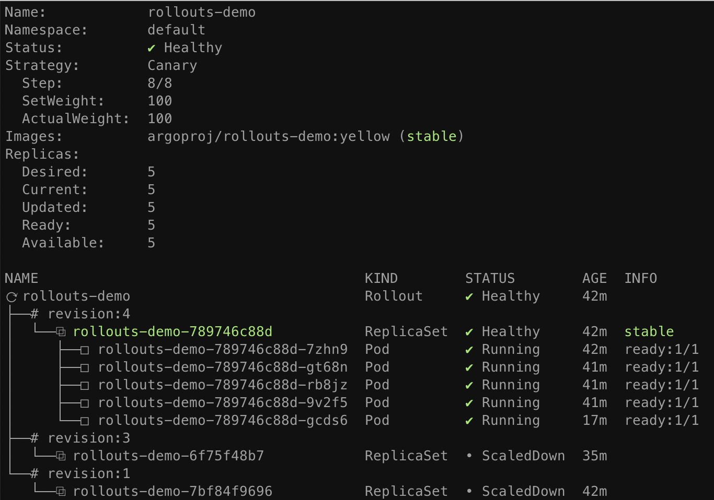

本指南通过演示部署、升级、推广和终止 Rollout 来演示 Argo Rollouts 的各种概念和特性。

## 要求

- 安装了 argo-rollouts 控制器的 Kubernetes 集群（请参阅 [安装指南](../../installation/)）
- 安装了带有 argo-rollouts 插件的 kubectl（请参阅 [安装指南](../../installation/)）

## 1. 部署 Rollout

首先，我们部署一个 Rollout 资源和一个针对该 Rollout 的 Kubernetes Service。本指南中的示例 Rollout 利用了金丝雀升级策略，该策略将 20％的流量发送到金丝雀，然后进行手动推广，最后对其余升级进行逐渐自动化的流量增加。此行为在 Rollout spec 的以下部分中描述：

```yaml
spec:
  replicas: 5
  strategy:
    canary:
      steps:
      - setWeight: 20
      - pause: {}
      - setWeight: 40
      - pause: {duration: 10}
      - setWeight: 60
      - pause: {duration: 10}
      - setWeight: 80
      - pause: {duration: 10}
```

运行以下命令以部署初始 Rollout 和 Service：

```bash
kubectl apply -f https://raw.githubusercontent.com/argoproj/argo-rollouts/master/docs/getting-started/basic/rollout.yaml
kubectl apply -f https://raw.githubusercontent.com/argoproj/argo-rollouts/master/docs/getting-started/basic/service.yaml
```

任何 Rollout 的初始创建都将立即将副本扩展到 100％（跳过任何金丝雀升级步骤、分析等），因为没有进行升级。

Argo Rollouts kubectl 插件允许你可视化 Rollout 及其相关资源（ReplicaSets、Pods、AnalysisRuns），并呈现随着其发生的实时状态更改。要观察部署过程，请从插件运行 `get rollout --watch` 命令：

```bash
kubectl argo rollouts get rollout rollouts-demo --watch
```


## 2. 更新 Rollout

接下来是执行更新。与部署一样，对 Pod 模板字段（`spec.template`）的任何更改都会导致部署新版本（即 ReplicaSet）。更新 Rollout 涉及修改 Rollout 规范，通常使用新版本更改容器镜像字段，然后对新清单运行 `kubectl apply`。作为方便，rollouts 插件提供了一个 `set image` 命令，它针对现场 Rollout 对象执行这些步骤。运行以下命令，使用容器的“yellow”版本更新 `rollouts-demo` Rollout：

```bash
kubectl argo rollouts set image rollouts-demo rollouts-demo=argoproj/rollouts-demo:yellow
```

在升级过程中，控制器将按照 Rollout 的升级策略的定义进行进度。示例 Rollout 将 20％的流量权重设置为金丝雀，暂停升级，并无限期地保持暂停状态，直到采取用户操作来取消暂停 / 推广 Rollout。更新镜像后，请再次观察 Rollout，直到其达到暂停状态：

```bash
kubectl argo rollouts get rollout rollouts-demo --watch
```


当演示 Rollout 达到第二步时，我们可以从插件中看到 Rollout 处于暂停状态，现在有 5 个副本中的 1 个正在运行 Pod 模板的新版本，而 4 个副本正在运行旧版本。这相当于由 `setWeight: 20` 步骤定义的 20％金丝雀权重。

## 3. 推广 Rollout

现在 Rollout 处于暂停状态。当 Rollout 到达没有持续时间的 `pause` 步骤时，它将一直保持暂停状态，直到恢复 / 推广为止。要手动将 Rollout 推广到下一步，请运行插件的 `promote` 命令：

```bash
kubectl argo rollouts promote rollouts-demo
```

推广后，Rollout 将继续执行其余步骤。我们示例中的其余升级步骤都是完全自动化的，因此 Rollout 最终将完成步骤，直到完全过渡到新版本为止。再次观察 Rollout，直到完成所有步骤：

```bash
kubectl argo rollouts get rollout rollouts-demo --watch
```


**提示**

`promote` 命令还支持使用 `--full` 标志跳过所有剩余步骤和分析的能力。

一旦所有步骤成功完成，新的 ReplicaSet 将被标记为“稳定”的 ReplicaSet。每当 Rollout 在更新期间中止（自动通过失败的金丝雀分析或手动通过用户），Rollout 将回退到 `stable` 版本。

## 4. 终止 Rollout

接下来，我们将学习如何在更新期间手动中止 Rollout。首先，使用 `set image` 命令部署新的“红色”容器版本，并等待 Rollout 再次达到暂停步骤：

```bash
kubectl argo rollouts set image rollouts-demo rollouts-demo=argoproj/rollouts-demo:red
```


这次，不是将 Rollout 推广到下一步，而是中止更新，以使其回退到 `stable` 版本。插件提供了一个 `abort` 命令作为手动中止更新期间 Rollout 的一种方式：

```bash
kubectl argo rollouts abort rollouts-demo
```

当 Rollout 中止时，它将扩展 `stable` 版本的 ReplicaSet（在本例中为黄色镜像），并缩小任何其他版本。尽管 ReplicaSet 的稳定版本正在运行并且健康，但仍将整体 Rollout 视为 `降级`，因为所需版本（红色镜像）不是实际运行的版本。


为了使 Rollout 再次被认为是 Healthy 而不是 Degraded，有必要将所需状态更改回以前的稳定版本。这通常涉及针对以前的 Rollout spec 运行 `kubectl apply`。在我们的情况下，我们可以简单地使用先前的“黄色”镜像重新运行 `set image` 命令。

```bash
kubectl argo rollouts set image rollouts-demo rollouts-demo=argoproj/rollouts-demo:yellow
```

运行此命令后，你应该注意到 Rollout 立即变为 Healthy，并且没有任何与新 ReplicaSets 创建相关的活动。



当 Rollout 尚未达到所需状态（例如，它被中止或正在升级中），并且稳定清单已重新应用时，Rollout 将检测到此为回滚而不是升级，并将通过跳过分析和步骤快速跟踪稳定版本 ReplicaSet 的部署。

## 总结

在本指南中，我们学习了 Argo Rollouts 的基本功能，包括：

- 部署 Rollout
- 执行金丝雀升级
- 手动推广
- 手动中止

本基本示例中的 Rollout 未使用入口控制器或服务网格提供程序来路由流量。相反，它使用正常的 Kubernetes Service 网络（即 kube-proxy）实现了一个“近似的”金丝雀权重，基于新旧副本计数的最接近比率。因此，此 Rollout 具有一项限制，即只能通过将 5 个 Pod 之一扩展为运行新版本来实现最小的金丝雀权重 20％。为了实现更细粒度的金丝雀，需要使用入口控制器或服务网格。

请按照流量路由指南之一，查看 Argo Rollouts 如何利用网络提供程序实现更高级的流量整形。

- [ALB 指南](alb/)
- [App Mesh 指南](appmesh/)
- [Ambassador 指南](ambassador/)
- [Istio 指南](istio/)
- [多个提供程序指南](mixed/)
- [NGINX 指南](nginx/)
- [SMI 指南](smi/)
