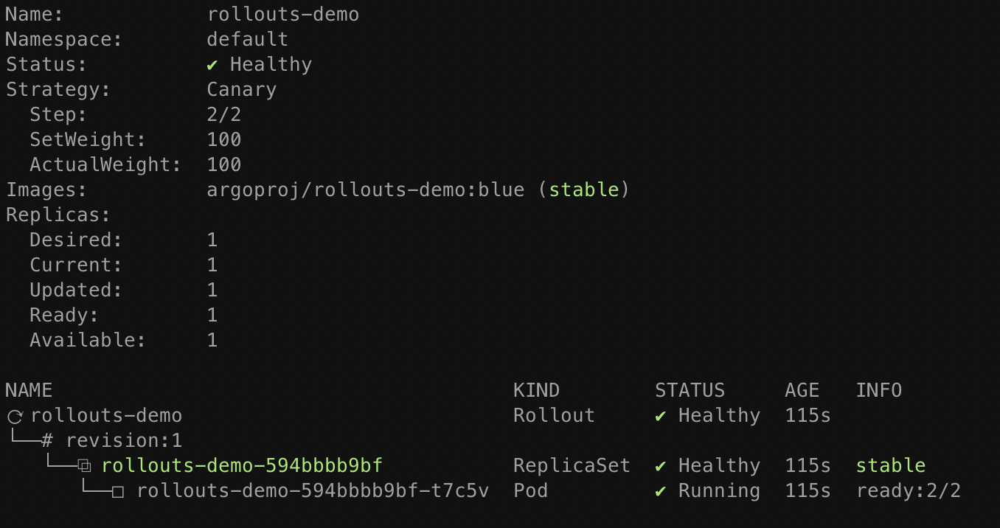
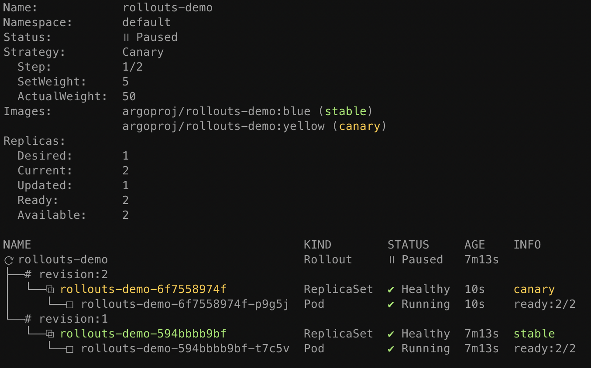

本指南介绍了 Argo Rollouts 如何与[Istio Service Mesh](https://istio.io/)集成进行流量塑形。本指南建立在[基本入门指南](../basic-usage/)的概念基础上。

## 要求

- 安装了 Istio 的 Kubernetes 集群

**提示**

请参见 [Istio 环境设置指南](https://argo-rollouts.readthedocs.io/en/stable/getting-started/setup/#istio-setup)，了解如何在本地 minikube 环境中设置 Istio。

## 1. 部署 Rollout、服务、Istio VirtualService 和 Istio Gateway

当使用 Istio 作为流量路由器时，Rollout 金丝雀策略必须定义以下强制字段：

```yaml
apiVersion: argoproj.io/v1alpha1
kind: Rollout
metadata:
  name: rollouts-demo
spec:
  strategy:
    canary:
      # 引用控制器用于指向金丝雀副本集的 Service
      canaryService: rollouts-demo-canary
      # 引用控制器用于指向稳定副本集的 Service
      stableService: rollouts-demo-stable
      trafficRouting:
        istio:
          virtualServices:
          # 可以配置一个或多个 VirtualService
          # 引用控制器用于更新金丝雀权重的 VirtualService
          - name: rollouts-demo-vsvc1
            # 如果 VirtualService 中有一个 HTTP 路由，则可选，否则必填
            routes:
            - http-primary
            # 如果 VirtualService 中有一个 HTTPS/TLS 路由，则可选，否则必填
            tlsRoutes:
            # 下面的字段都是可选的，但如果定义了，则必须与你的 VirtualService 中至少一个 TLS 路由匹配规则完全匹配
            - port: 443 # 仅在你希望匹配包含此端口的任何规则的 VirtualService 时才需要
              # 仅在你希望匹配所有这些 SNI 主机的任何规则的 VirtualService 时才需要
              sniHosts:
              - reviews.bookinfo.com
              - localhost
          - name: rollouts-demo-vsvc2
            # 如果 VirtualService 中有一个 HTTP 路由，则可选，否则必填
            routes:
              - http-secondary
            # 如果 VirtualService 中有一个 HTTPS/TLS 路由，则可选，否则必填
            tlsRoutes:
              # 下面的字段都是可选的，但如果定义了，则必须与你的 VirtualService 中至少一个 TLS 路由匹配规则完全匹配
              - port: 443 # 仅在你希望匹配包含此端口的任何规则的 VirtualService 时才需要
                # 仅在你希望匹配所有这些 SNI 主机的任何规则的 VirtualService 时才需要
                sniHosts:
                  - reviews.bookinfo.com
                  - localhost
            tcpRoutes:
              # 下面的字段都是可选的，但如果定义了，则必须与你的 VirtualService 中至少一个 TCP 路由匹配规则完全匹配
              - port: 8020 # 仅在你希望匹配包含此端口的任何规则的 VirtualService 时才需要

```

在`trafficRouting.istio.virtualService`或`trafficRouting.istio.virtualServices`中引用的 VirtualService 和路由。`trafficRouting.istio.virtualServices`可以帮助添加一个或多个 VirtualService，而`trafficRouting.istio.virtualService`只能添加单个 virtualService。这是为了有 HTTP、TLS、TCP 或混合路由规范，将稳定服务和金丝雀服务分开。如果路由是 HTTPS/TLS，则可以根据给定的端口号和/或 SNI 主机进行匹配。请注意，它们两个都是可选的，只有在你想要匹配包含这些规则的 VirtualService 时才需要它们。

在本指南中，这两个服务分别是：`rollouts-demo-stable`和`rollouts-demo-canary`。这两个服务的权重应最初设置为稳定服务的 100% 和金丝雀服务的 0%。在更新期间，这些值将由控制器修改。如果有多个 VirtualService，则控制器将同时修改每个 VirtualService 的稳定和金丝雀服务的权重值。

请注意，由于我们的 Rollout 规范中有 HTTP 和 HTTPS 路由，并且它们匹配 VirtualService 规范，因此权重将同时针对这两个路由进行修改。

```yaml
apiVersion: networking.istio.io/v1alpha3
kind: VirtualService
metadata:
  name: rollouts-demo-vsvc1
spec:
  gateways:
  - rollouts-demo-gateway
  hosts:
  - rollouts-demo-vsvc1.local
  http:
  - name: http-primary  # 应与 rollout.spec.strategy.canary.trafficRouting.istio.virtualServices.routes 匹配
    route:
    - destination:
        host: rollouts-demo-stable  # 应与 rollout.spec.strategy.canary.stableService 匹配
        port:
          number: 15372
      weight: 100
    - destination:
        host: rollouts-demo-canary  # 应与 rollout.spec.strategy.canary.canaryService 匹配
        port:
          number: 15372
      weight: 0
  tls:
  - match:
    - port: 443  # 应与 rollout.spec.strategy.canary.trafficRouting.istio.virtualServices.tlsRoutes 中定义的路由的端口号匹配
      sniHosts: # 应与 rollout.spec.strategy.canary.trafficRouting.istio.virtualServices.tlsRoutes 中定义的路由的所有 SNI 主机匹配
      - reviews.bookinfo.com
      - localhost
    route:
    - destination:
        host: rollouts-demo-stable  # 应与 rollout.spec.strategy.canary.stableService 匹配
      weight: 100
    - destination:
        host: rollouts-demo-canary  # 应与 rollout.spec.strategy.canary.canaryService 匹配
      weight: 0
  tcp:
  - match:
      - port: 8020 # 应与 rollout.spec.strategy.canary.trafficRouting.istio.virtualServices.tcpRoutes 中定义的路由的端口号匹配
    route:
    - destination:
        host: rollouts-demo-stable # 应与 rollout.spec.strategy.canary.stableService 匹配
      weight: 100
    - destination:
        host: rollouts-demo-canary # 应与 rollout.spec.strategy.canary.canaryService 匹配
      weight: 0
```

```yaml
apiVersion: networking.istio.io/v1alpha3
kind: VirtualService
metadata:
  name: rollouts-demo-vsvc2
spec:
  gateways:
  - rollouts-demo-gateway
  hosts:
  - rollouts-demo-vsvc2.local
  http:
  - name: http-secondary  # 应该与 rollout.spec.strategy.canary.trafficRouting.istio.virtualServices.routes 匹配
    route:
    - destination:
        host: rollouts-demo-stable  # 应该与 rollout.spec.strategy.canary.stableService 匹配
        port:
          number: 15373
      weight: 100
    - destination:
        host: rollouts-demo-canary  # 应该与 rollout.spec.strategy.canary.canaryService 匹配
        port:
          number: 15373
      weight: 0
  tls:
  - match:
    - port: 443  # 应该与 rollout.spec.strategy.canary.trafficRouting.istio.virtualServices.tlsRoutes 中定义的路由的端口号匹配
      sniHosts: # 应该与 rollout.spec.strategy.canary.trafficRouting.istio.virtualServices.tlsRoutes 中定义的路由的所有 SNI 主机匹配
      - reviews.bookinfo.com
    route:
    - destination:
        host: rollouts-demo-stable  # 应该与 rollout.spec.strategy.canary.stableService 匹配
      weight: 100
    - destination:
        host: rollouts-demo-canary  # 应该与 rollout.spec.strategy.canary.canaryService 匹配
      weight: 0
  tcp:
  - match:
    - port: 8020  # 应该与 rollout.spec.strategy.canary.trafficRouting.istio.virtualServices.tcpRoutes 中定义的路由的端口号匹配
    route:
    - destination:
        host: rollouts-demo-stable  # 应该与 rollout.spec.strategy.canary.stableService 匹配
      weight: 100
    - destination:
        host: rollouts-demo-canary  # 应该与 rollout.spec.strategy.canary.canaryService 匹配
      weight: 0
```

运行以下命令进行部署：

- 一个 Rollout
- 两个服务（稳定和金丝雀）
- 一个或多个 Istio VirtualServices
- 一个 Istio Gateway

```bash
kubectl apply -f https://raw.githubusercontent.com/argoproj/argo-rollouts/master/docs/getting-started/istio/rollout.yaml
kubectl apply -f https://raw.githubusercontent.com/argoproj/argo-rollouts/master/docs/getting-started/istio/services.yaml
kubectl apply -f https://raw.githubusercontent.com/argoproj/argo-rollouts/master/docs/getting-started/istio/multipleVirtualsvc.yaml
kubectl apply -f https://raw.githubusercontent.com/argoproj/argo-rollouts/master/docs/getting-started/istio/gateway.yaml
```

应用清单后，你应该在集群中看到以下 Rollout、服务、virtualservices 和 gateway 资源：

```bash
$ kubectl get ro
NAME            DESIRED   CURRENT   UP-TO-DATE   AVAILABLE
rollouts-demo   1         1         1            1

$ kubectl get svc
NAME                   TYPE        CLUSTER-IP       EXTERNAL-IP   PORT(S)   AGE
rollouts-demo-canary   ClusterIP   10.103.146.137   <none>        80/TCP    37s
rollouts-demo-stable   ClusterIP   10.101.158.227   <none>        80/TCP    37s

$ kubectl get virtualservice
NAME                  GATEWAYS                  HOSTS                         AGE
rollouts-demo-vsvc1   [rollouts-demo-gateway]   [rollouts-demo-vsvc1.local]   54s
rollouts-demo-vsvc2   [rollouts-demo-gateway]   [rollouts-demo-vsvc2.local]   54s

$ kubectl get gateway
NAME                    AGE
rollouts-demo-gateway   71s
```

```bash
kubectl argo rollouts get rollout rollouts-demo
```



## 2. 执行更新

通过更改镜像来更新 Rollout，并等待其达到暂停状态。

```shell
kubectl argo rollouts set image rollouts-demo rollouts-demo=argoproj/rollouts-demo:yellow
kubectl argo rollouts get rollout rollouts-demo
```



此时，Rollout 的金丝雀和稳定版本都在运行，将 5% 的流量定向到金丝雀。要了解其工作原理，请检查 Rollout 所引用的 VirtualService。当查看两个 VirtualService 时，我们可以看到控制器已修改路由目标权重，以反映金丝雀的当前权重。

```yaml
apiVersion: networking.istio.io/v1beta1
kind: VirtualService
metadata:
  name: rollouts-demo-vsvc1
  namespace: default
spec:
  gateways:
  - rollouts-demo-gateway
  hosts:
  - rollouts-demo-vsvc1.local
  http:
  - name: http-primary
    route:
    - destination:
        host: rollouts-demo-stable
        port:
          number: 15372
      weight: 95
    - destination:
        host: rollouts-demo-canary
        port:
          number: 15372
      weight: 5
  tls:
  - match:
    - port: 443
      sniHosts:
      - reviews.bookinfo.com
      - localhost
    route:
    - destination:
        host: rollouts-demo-stable
      weight: 95
    - destination:
        host: rollouts-demo-canary
      weight: 5
  tcp:
  - match:
    - port: 8020
    route:
    - destination:
        host: rollouts-demo-stable
      weight: 95
    - destination:
        host: rollouts-demo-canary
      weight: 5
```

```yaml
apiVersion: networking.istio.io/v1beta1
kind: VirtualService
metadata:
  name: rollouts-demo-vsvc2
  namespace: default
spec:
  gateways:
  - rollouts-demo-gateway
  hosts:
  - rollouts-demo-vsvc2.local
  http:
  - name: http-primary
    route:
    - destination:
        host: rollouts-demo-stable
        port:
          number: 15373
      weight: 95
    - destination:
        host: rollouts-demo-canary
        port:
          number: 15373
      weight: 5
  tls:
  - match:
    - port: 443
      sniHosts:
      - reviews.bookinfo.com
    route:
    - destination:
        host: rollouts-demo-stable
      weight: 95
    - destination:
        host: rollouts-demo-canary
      weight: 5
  tcp:
  - match:
    - port: 8020
    route:
    - destination:
        host: rollouts-demo-stable
      weight: 95
    - destination:
        host: rollouts-demo-canary
      weight: 5
```

随着 Rollout 通过步骤进行，HTTP、TLS 和/或 TCP 路由的目标权重将被调整以匹配步骤的当前`setWeight`。
