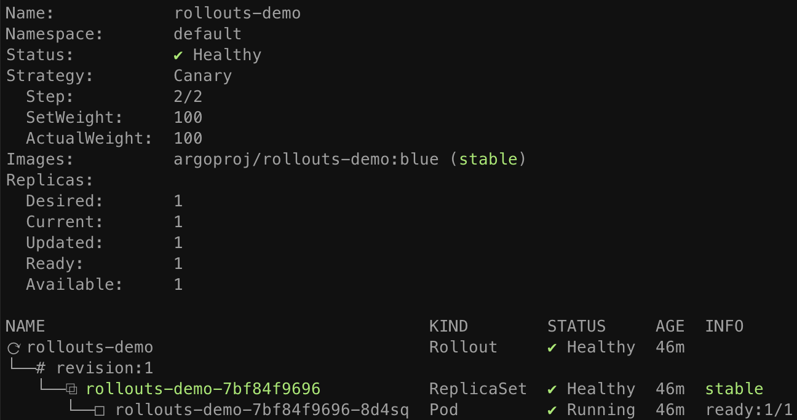

本指南介绍了 Argo Rollouts 如何与 [NGINX Ingress Controller](https://github.com/kubernetes/ingress-nginx) 集成进行流量整形。本指南基于 [基本入门指南](../basic-usage/) 的概念。

## 要求

- 安装了 NGINX Ingress 控制器的 Kubernetes 群集

🔔 提示：请参阅 [NGINX 环境设置指南](https://argo-rollouts.readthedocs.io/en/stable/getting-started/setup/#nginx-ingress-controller-setup) 以了解如何使用 nginx 设置本地 minikube 环境。

## 1. 部署 Rollout、服务和 Ingress

当使用 NGINX Ingress 作为流量路由器时，Rollout 金丝雀策略必须定义以下强制字段：

```yaml
 apiVersion: argoproj.io/v1alpha1
 kind: Rollout
 metadata:
   name: rollouts-demo
 spec:
   strategy:
     canary:
       # 引用控制器将更新并指向金丝雀 ReplicaSet 的服务
       canaryService: rollouts-demo-canary
       # 引用控制器将更新并指向稳定 ReplicaSet 的服务
       stableService: rollouts-demo-stable
       trafficRouting:
         nginx:
           # 引用一个 Ingress，该 Ingress 具有指向稳定服务（例如 rollouts-demo-stable）的规则
           # 为了实现 NGINX 流量分割，此 ingress 将被克隆为一个新名称。
           stableIngress: rollouts-demo-stable
 ...
```

在 `canary.trafficRouting.nginx.stableIngress` 中引用的 Ingress 必须具有后端，该后端指向 `canary.stableService` 下引用的服务。在我们的示例中，该稳定服务的名称为 `rollouts-demo-stable`：

```
 apiVersion: networking.k8s.io/v1beta1
 kind: Ingress
 metadata:
   name: rollouts-demo-stable
   annotations:
     kubernetes.io/ingress.class: nginx
 spec:
   rules:
   - host: rollouts-demo.local
     http:
       paths:
       - path: /
         backend:
           # 引用一个服务名称，也在 Rollout 规范的 `strategy.canary.stableService` 中指定
           serviceName: rollouts-demo-stable
           servicePort: 80
```

运行以下命令以部署：

- 一个 Rollout
- 两个服务（稳定和金丝雀）
- 一个 Ingress

```bash
kubectl apply -f https://raw.githubusercontent.com/argoproj/argo-rollouts/master/docs/getting-started/nginx/rollout.yaml
kubectl apply -f https://raw.githubusercontent.com/argoproj/argo-rollouts/master/docs/getting-started/nginx/services.yaml
kubectl apply -f https://raw.githubusercontent.com/argoproj/argo-rollouts/master/docs/getting-started/nginx/ingress.yaml
```

应用清单后，你应该在群集中看到以下滚动、服务和 Ingress 资源：

```bash
$ kubectl get ro
NAME            DESIRED   CURRENT   UP-TO-DATE   AVAILABLE
rollouts-demo   1         1         1            1

$ kubectl get svc
NAME                   TYPE        CLUSTER-IP      EXTERNAL-IP   PORT(S)   AGE
rollouts-demo-canary   ClusterIP   10.96.6.241     <none>        80/TCP    33s
rollouts-demo-stable   ClusterIP   10.102.229.83   <none>        80/TCP    33s

$ kubectl get ing
NAME                                        CLASS    HOSTS                 ADDRESS        PORTS   AGE
rollouts-demo-stable                        <none>   rollouts-demo.local   192.168.64.2   80      36s
rollouts-demo-rollouts-demo-stable-canary   <none>   rollouts-demo.local   192.168.64.2   80      35s
```

你还应该注意到由 rollouts 控制器创建的第二个 Ingress，`rollouts-demo-rollouts-demo-stable-canary`。这个 Ingress 是“金丝雀 Ingress”，是用户管理的 Ingress 的克隆，其引用在 `nginx.stableIngress` 下。它由 nginx ingress 控制器用于实现金丝雀流量分割。生成的 ingress 名称使用 `<ROLLOUT-NAME>-<INGRESS-NAME>-canary` 进行公式化。有关第二个 Ingress 的更多详细信息在下一节中讨论。

```bash
kubectl argo rollouts get rollout rollouts-demo
```



## 2. 执行更新

通过更改镜像来更新 rollout，并等待其达到暂停状态。

```bash
kubectl argo rollouts set image rollouts-demo rollouts-demo=argoproj/rollouts-demo:yellow
kubectl argo rollouts get rollout rollouts-demo
```


此时，Rollout 的金丝雀和稳定版本都正在运行，其中 5% 的流量定向到金丝雀。需要注意的是，尽管只运行了两个 pod，但是 Rollout 能够实现 5% 的金丝雀权重。这可以通过在 ingress 控制器中发生流量分割（而不是加权副本计数和 kube-proxy）来实现。

在检查 Rollout 控制器生成的 Ingress 副本时，我们发现它与原始 Ingress 相比具有以下更改：

1. 添加了两个附加的 [NGINX 特定的金丝雀注释](https://kubernetes.github.io/ingress-nginx/user-guide/nginx-configuration/annotations/#canary) 到注释中。
2. Ingress 规则将具有指向 *金丝雀* 服务的规则。

```yaml
apiVersion: extensions/v1beta1
kind: Ingress
metadata:
  name: rollouts-demo-rollouts-demo-stable-canary
  annotations:
    kubernetes.io/ingress.class: nginx
    nginx.ingress.kubernetes.io/canary: "true"
    nginx.ingress.kubernetes.io/canary-weight: "5"
spec:
  rules:
  - host: rollouts-demo.local
    http:
      paths:
      - backend:
          serviceName: rollouts-demo-canary
          servicePort: 80
```

随着 Rollout 通过步骤进行，`canary-weight` 注释将根据步骤的 `setWeight` 调整。NGINX Ingress 控制器检查原始 Ingress、金丝雀 Ingress 和 `canary-weight` 注释，以确定在两个 Ingress 之间拆分多少流量。
