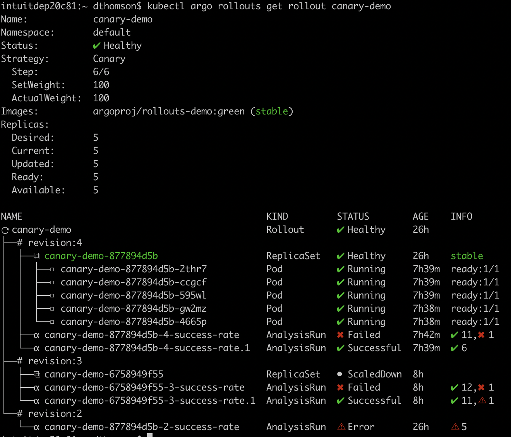

Kubectl 插件是一种扩展 kubectl 命令提供额外行为的方式。通常，它们用于添加新功能到 kubectl 并自动化可脚本化的工作流程来操作集群。官方文档可在 [此处](https://kubernetes.io/docs/tasks/extend-kubectl/kubectl-plugins/) 找到。

Argo Rollouts 提供了一个 Kubectl 插件来丰富 Rollouts、Experiments 和 Analysis 的体验。它提供了可视化 Argo Rollouts 资源的能力并从命令行上运行常规操作，例如 promote 或 retry。

## 安装

请参阅 [安装指南](../../installation/) 了解安装插件的说明。

## 用法

获取有关可用的 Argo Rollouts kubectl 插件命令的信息的最佳方法是运行 `kubectl argo rollouts`。插件列出了该工具可以执行的所有可用命令以及每个命令的描述。所有插件命令与 Kubernetes API 服务器交互，并使用 KubeConfig 凭据进行身份验证。由于插件利用运行命令的用户的 KubeConfig，因此插件具有这些配置的权限。

与 kubectl 类似，该插件使用许多与 kubectl 相同的标志。例如，`kubectl argo rollouts get rollout canary-demo -w` 命令会在`canary-demo` rollout 对象上启动一个 watch，类似于`kubectl get deployment canary-demo -w` 命令在部署上启动一个 watch。

## 可视化 Rollouts 和 Experiments

除了封装许多常规命令之外，Argo Rollouts kubectl 插件还支持使用 get 命令可视化 rollouts 和 experiments。get 命令提供了一个干净的表示形式，用于表示在群集中运行的 rollouts 或 experiments。它返回关于资源的大量元数据，以及父资源创建的子资源的树状视图。以下是使用 get 命令检索到的一个 rollout 的示例：

下面是一个表格，解释了树视图上的一些图标：

| 图标 | Kind        |
| ---- | ----------- |
| ⟳    | Rollout     |
| Σ    | Experiment  |
| α    | AnalysisRun |
| #    | Revision    |
| ⧉    | ReplicaSet  |
| □    | Pod         |
| ⊞    | Job         |

如果 get 命令包括 watch 标志（`-w`或`--watch`），则终端会随着 rollouts 或 experiments 的进展而更新，突出显示进度。