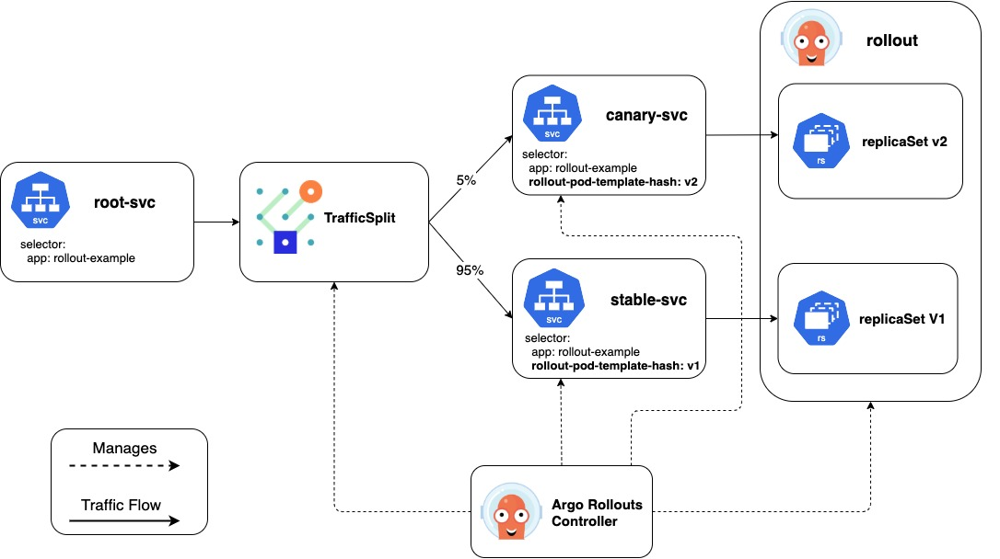

!!! important
    Available since v0.9.0

[Service Mesh Interface](https://smi-spec.io/) (SMI) is a standard interface for service meshes on Kubernetes leveraged by many Service Mesh implementations (like Linkerd). SMI offers this functionality through a set of CRDs, and the Argo Rollouts controller creates these resources to manipulate the traffic routing into the desired state. 

The Argo Rollout controller achieves traffic shaping by creating and manipulating the [TrafficSplit CR](https://github.com/servicemeshinterface/smi-spec/blob/master/traffic-split.md). A TrafficSplit describes the desired traffic routing for an application and relies on the underlying Service Meshes implement that desired state. Instead of worrying about the details of a specific service mesh, a user needs to specify a root Service that clients use to communicate and a list of backends consisting of a Service and weight. The Service Mesh implementing SMI uses this spec to route traffic to the backends Services based on the weights of the backends. For Rollout users, the Argo Rollout controller creates and manipulates the TrafficSplit using the following information:

- Canary Service: Name of the service that sends traffic only to the canary pods
- Stable Service: Name of the service that sends traffic only to the stable po ds
- Root Service: Name of the service that clients use to communicate. If a request comes to this root service not through a proxy, the standard Kubernetes service routing will be used.

Below is an example of a Rollout with all the required fields configured:

```yaml
apiVersion: argoproj.io/v1alpha1
kind: Rollout
metadata:
  name: rollout-example
spec:
  ...
  strategy:
    canary:
      steps:
      - setWeight: 5
      - pause:
          duration: 600
      canaryService: canary-svc # required
      stableService: stable-svc # required
      trafficRouting:
        smi:
         rootService: root-svc # optional
         trafficSplitName: rollout-example-traffic-split # optional
```



With the above configuration, the controller can automate dynamic traffic splitting. First, the controller manipulates the canary and stable Service listed in the Rollout to make them only receive traffic from the respective canary and stable ReplicaSets. The controller achieves this by adding the ReplicaSet's unique pod template hash to that Service's selector. With the stable and canary Services configured, the controller creates a TrafficSplit using these Services in the backend, and the weights of the backend are dynamically configured from the current desired weight of the Rollout's canary steps. The controller sets the TrafficSplit's root service to the stableService unless the Rollout has the rootService field specified. This configured TrafficSplit along with the Service and Rollout resources enable fine-grained percentages of traffic between two versions of an application. Optionally, the user can specify a name for the traffic split. If there is no name listed in the Rollout, the controller uses the Rollout's name for the TrafficSplit. If a TrafficSplit with that name already exists and isn't owned by that Rollout, the controller marks the Rollout as an error state.

Here is the TrafficSplit created from the above Rollout:

```yaml
apiVersion: split.smi-spec.io/v1alpha1
kind: TrafficSplit
metadata:
  name: rollout-example-traffic-split
spec:
  service: root-svc # controller uses the stableService if Rollout does not specify the rootService field
  backends:
  - service: stable-svc
    weight: 95
  - service: canary-svc
    weight: 5
```

As a Rollout progresses through all its steps, the controller updates the TrafficSplit's backend weights to reflect the current weight of the Rollout. When the Rollout has successfully finished executing all the steps, the controller modifies the stable Service's selector to point at the desired ReplicaSet and TrafficSplit's weight to send 100% of traffic to the stable Service.

!!! note
    The controller defaults to using the `v1alpha1` version of the TrafficSplit. The Argo Rollouts operator can change the api version used by specifying a `--traffic-split-api-version` flag in the controller args.
