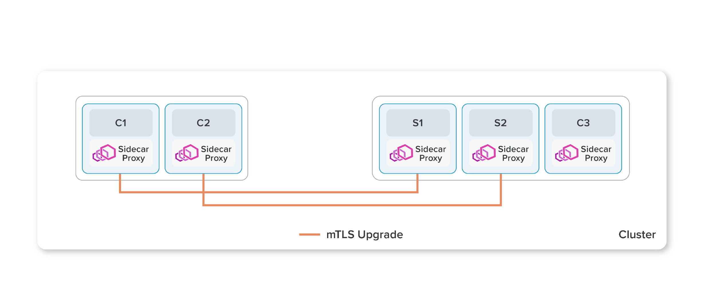
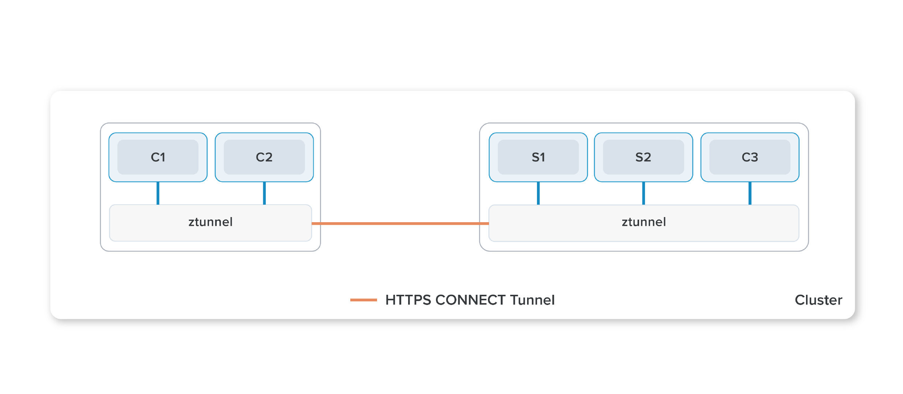
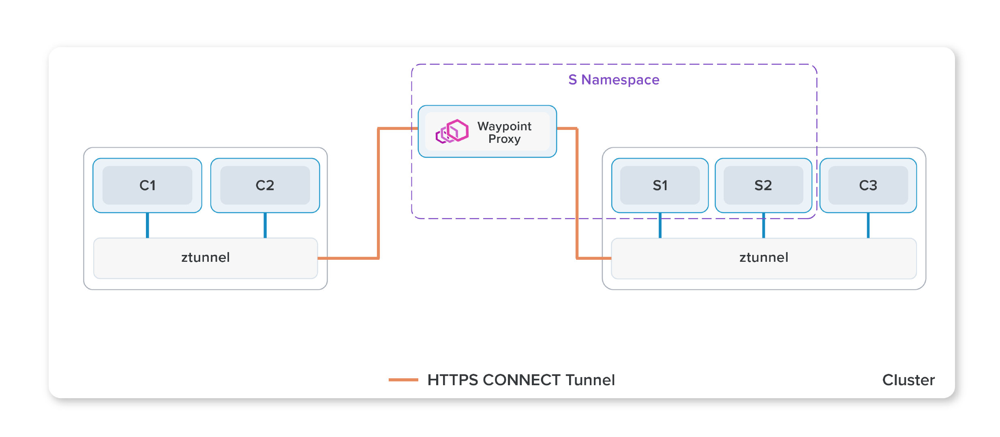

今天，我们很高兴地介绍 **Ambient Mesh**（译者注：笔者更倾向于将其称为 Ambient Mode，即外围模式），这是一种新的 Istio 数据平面模式，旨在简化操作、扩大应用兼容性并降低基础设施成本。用户可以选择将 Ambient Mesh 集成到其基础设施的网格数据平面，放弃 sidecar 代理，同时保持 Istio 的零信任安全、遥测和流量管理等核心功能。我们正在与 Istio 社区分享 Ambient Mesh 的预览版，我们正努力在未来几个月内将其推向生产就绪。

## Istio 和 Sidecar

自项目成立以来，Istio 架构的一个决定性特征是使用 sidecar—— 与应用容器一起部署的可编程代理。利用 sidecar，不需要对应用程序进行重大调整即可以享受服务网格带来的好处，省去运维的负担。

虽然 sidecar 比起重构应用程序有显著的优势，但它们并没有在应用程序和 Istio 数据平面之间提供一个完美的分离。这导致了一些限制：

- **侵入性**：sidecar 必须通过修改其 Kubernetes pod 配置和重定向 pod 内的流量来 **注入** 应用程序。因此，安装或升级 sidecar 需要重新启动应用 pod，这对工作负载来说可能是破坏性的。
- **资源利用率低**：由于在每个工作负载 pod 都注入了 sidecar 代理，pod 必须为 sidecar 保留足够的 CPU 和内存，这可能导致整个集群的资源利用率下降。
- **流量中断**：流量捕获和 HTTP 处理，通常由 Istio 的 sidecar 完成，计算成本很高，可能会破坏一些具有不符合 HTTP 实现的应用程序。

虽然 sidecar 有它的用武之地，后面会有更多的介绍 —— 但我们认为需要有一个侵入性更低、更容易的选择，这将更适合许多服务网格用户。

## 分层

传统上，Istio 在单一的架构组件中实现了所有的数据平面功能，从基本的加密到高级的 L7 策略，这就是 sidecar。在实践中，这使得 sidecar 成为一个全有或全无的主张。即使工作负载只需要简单的传输安全，管理员仍然需要承担部署和维护 sidecar 的运营成本。Sidecar 对每个工作负载都有固定的运营成本，无法根据用例的复杂性进行扩展。

Ambient Mesh 采取了一种不同的方法。它将 Istio 的功能分成两个不同的层次。在底层，有一个安全覆盖层，处理流量的路由和零信任安全。在这之上，当需要时，用户可以启用 L7 处理，以获得 Istio 的全部功能。L7 处理模式虽然比安全覆盖层更重，但仍作为基础设施的一个外围组件运行，不需要对应用 pod 进行修改。

这种分层方法使用户能够以更多的增量方式采用 Istio，从无网格到安全覆盖，再到完全的 L7 处理，根据需要以每个命名空间为基础进行平稳过渡。此外，在不同氛围模式下运行的工作负载，或与 sidecar 无缝互通，允许用户根据随时间变化的特定需求来混合和匹配能力。

**构建 Ambient Mesh**

Ambient Mesh 使用一个共享代理（agent），在 Kubernetes 集群的每个节点上运行。这个代理是一个零信任隧道（ztunnel），它的主要职责是安全地连接和验证网格内的元素。节点上的网络堆栈将参与工作负载的所有流量通过本地 ztunnel 代理重定向。这将 Istio 的数据平面与应用程序的关注点完全分开，最终允许运营人员启用、禁用、扩展和升级数据平面而不干扰应用程序。ztunnel 不对工作负载流量进行 L7 处理，使其明显比 sidecar 精简。这大大降低了复杂性和相关资源的使用成本，使它适合作为共享基础设施交付。

Ztunnel 实现了服务网格的核心功能：零信任。当为命名空间启用 Ambient 时，会创建一个安全覆盖层。它为工作负载提供 mTLS、遥测、认证和 L4 授权，而无需终止或解析 HTTP。

在启用 Ambient Mesh 和创建安全覆盖后，可以配置命名空间以利用 L7 功能。这允许命名空间实现全套的 Istio 功能，包括 [Virtual Service API](https://istio.io/latest/docs/reference/config/networking/virtual-service/)、[L7 遥测](https://istio.io/latest/docs/reference/config/telemetry/)和 [L7 授权策略](https://istio.io/latest/docs/reference/config/security/authorization-policy/)。以这种模式运行的命名空间使用一个或多个基于 Envoy 的 **Waypoint proxy**（路径点代理）来处理该命名空间的工作负载的 L7 处理。Istio 的控制平面将集群中的 ztunnel 配置为通过 waypoint 代理传递所有需要 L7 处理的流量。重要的是，从 Kubernetes 的角度来看，waypoint 代理只是普通的 pod，可以像其他 Kubernetes 部署一样进行自动扩展。我们预计这将为用户节省大量资源，因为路径代理可以自动扩展，以适应它们所服务的命名空间的实时流量需求，而不是运营人员预期的最大最坏情况下的负载。

Ambient Mesh 使用 **HTTP CONNECT over mTLS** 来实现其安全隧道，并在路径中插入 waypoint 代理，这种模式我们称之为 **HBONE**（HTTP-Based Overlay Network Environment，基于 HTTP 的重叠网络环境）。HBONE 提供了比 TLS 本身更干净的流量封装，同时实现了与普通负载均衡器基础设施的互操作性。默认使用 FIPS 构建，以满足合规性需求。关于 HBONE 的更多细节，其基于标准的方法，以及 UDP 和其他非 TCP 协议的计划，将在未来的博客中提供。

在一个网格中混合 sidecar 和 ambient，不会对系统的能力或安全属性带来限制。Istio 控制平面确保策略的正确执行，无论选择何种部署模式。Ambient 只是引入了一个具有更好的人机工程学和更多灵活性的选项。

## 为什么本地节点上没有 L7 处理？

Ambient 网格在节点上使用一个共享的 ztunnel 代理，它处理网格的零信任方面，而 L7 处理发生在单独调度的 pod 中的 waypoint 代理。为什么要费尽心机地进行转接，而不是直接在节点上使用一个共享的完整的 L7 代理？这有几个原因。

- Envoy 本质上不是多租户的。因此，我们对在一个共享实例中混合来自多个无约束租户的 L7 流量的复杂处理规则有安全方面的担忧。通过严格限制 L4 处理，我们大大减少了漏洞的半径。
- 与 waypoint 代理所需的 L7 处理相比，ztunnel 所提供的 mTLS 和 L4 功能需要的 CPU 和内存占用要小得多。通过将 waypoint 代理作为一个共享的命名空间资源来运行，我们可以根据该命名空间的需求来独立扩展它们，其成本不会不公平地分配给不相关的租户。
- 通过减少 ztunnel 的范围，我们允许它被其他安全隧道的实现所取代，这些实现可以满足一个明确的互操作性协议。

## 但是那些额外的跳数呢？

在 Ambient 网格中，waypoint 不一定保证与它所服务的工作负载在同一个节点上。虽然乍一看，这可能是一个性能问题，但我们相信，延迟最终将与 Istio 目前的 sidecar 实现保持一致。我们将在专门的性能博文中详细讨论，但现在我们将总结出两点。

- 事实上，Istio 的大部分网络延迟并不是来自于网络（现代的云供应商拥有极快的网络）。相反，最大的罪魁祸首是 Istio 需要密集的 L7 处理来实现其复杂的功能集。与 sidecar 不同的是，sidecar 为每个连接实现了两个 L7 处理步骤（每个 sidecar 一个），而 Ambient 网格这两个步骤压缩成一个。在大多数情况下，我们希望这种减少的处理成本能够补偿额外的网络跳跃。
- 用户通常在部署网格时，首先启用零信任的安全态势，然后根据需要选择性地启用 L7 功能。Ambient 网格允许这些用户在不需要时完全绕过 L7 处理。

## 资源开销

总的来说，我们希望 Ambient Mesh 对大多数用户来说要求更少的资源，让资源需求更可预测。ztunnel 的有限责任允许它作为一个共享资源部署在节点上。这将大大减少大多数用户为每个工作负载的预留资源。此外，由于 waypoint 代理是正常的 Kubernetes pod，它们可以根据其服务的工作负载的实时流量需求进行动态部署和扩展。

另一方面，sidecar 需要为每个工作负载的最坏情况保留内存和 CPU。进行这些计算是很复杂的，所以在实践中，管理员倾向于过度配置。这就导致了由于大量的资源预留导致其他工作负载无法被调度，从而导致节点利用率不足。Ambient 网格的每节点固定开销较低，动态扩展的 waypoint 代理需要的资源预留总体上要少得多，从而使集群的使用效率更高。

## 安全性如何？

一个全新的架构自然会带来安全方面的问题。[Ambient 安全博客](https://istio.io/latest/blog/2022/ambient-security/)对此做了深入的研究，我们将在此进行总结。

Sidecar 与它们所服务的工作负载共处一地，因此，一个人的漏洞会损害另一个人。在 Ambient Mesh 模型中，即使一个应用程序被破坏，Ztunnel 和 waypoint 代理仍然可以对被破坏的应用程序的流量执行严格的安全策略。此外，鉴于 Envoy 是世界上最大的网络运营商所使用的经过实战考验的成熟软件，它的脆弱性很可能低于与它一起运行的应用程序。

虽然 ztunnel 是一个共享资源，但它只能访问它所运行的节点上当前工作负载的密钥。因此，它的爆炸半径并不比任何其他依靠每个节点密钥进行加密的加密 CNI 差。另外，考虑到 ztunnel 有限的仅有的 L4 攻击面和 Envoy 的上述安全特性，我们觉得这种风险是有限的，可以接受的。

最后，虽然 waypoint 代理是一种共享资源，但它们只限于为一个服务账户服务。这使得它们不会比现在的 sidecar 更糟；如果一个 waypoint 代理被攻破，与该 waypoint 相关的凭证就会丢失，而不会有其他问题。

## 这是 sidecar 的终结吗？

肯定不是。虽然我们相信 Ambient Mesh 将是许多网格用户未来的最佳选择，但对于那些需要专用数据平面资源的用户来说，如合规性或性能调整，sidecar 仍然是一个不错的选择。Istio 将继续支持 sidecar，而且重要的是，允许它们与 Ambient Mesh 无缝互通。事实上，我们今天发布的 Ambient Mesh 代码已经支持与基于 sidecar 的 Istio 的互操作。

## 视频介绍

请看一个简短的 [YouTube 视频](https://youtu.be/nupRBh9Iypo)，看 Christian 运行 Istio Ambient Mesh 组件并演示一些功能。

## 参与进来

我们今天发布的是 Istio 中 Ambient Mesh 的早期版本，它在很大程度上仍处于积极的开发之中。我们很高兴与更广泛的社区分享它，并期待着在 2023 年进入生产就绪阶段时，让更多人参与塑造它。

我们希望得到你的反馈来帮助塑造这个解决方案。支持 Ambient Mesh 的 Istio 构建版可以在 [Istio 实验版](https://github.com/istio/istio/tree/experimental-ambient)中[下载和试用](https://istio.io/latest/blog/2022/get-started-ambient/)。在 [README](https://github.com/istio/istio/blob/experimental-ambient/README.md) 中提供了一份缺失功能和工作项目的清单。请尝试一下，并 [让我们知道你的想法](https://slack.istio.io/)！