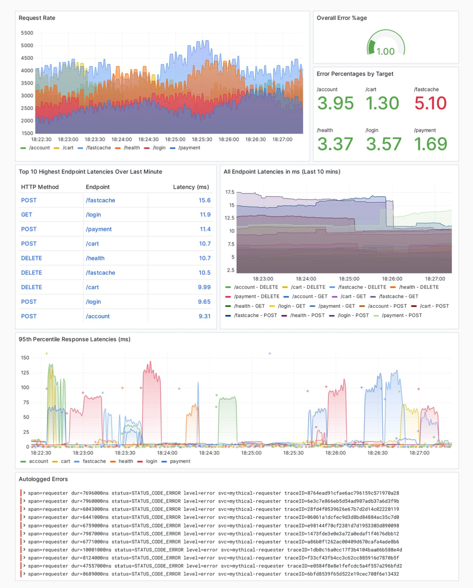

## 编者按

本文译自：[OpenTelemetry best practices: A user's guide to getting started with OpenTelemetry](https://grafana.com/blog/2023/12/18/opentelemetry-best-practices-a-users-guide-to-getting-started-with-opentelemetry/)

摘要：文章介绍了 OpenTelemetry 的概念和优势，以及如何使用 Grafana 的分发版进行自动和手动的仪表化、配置和导出数据。

评论：这是一篇非常实用和有价值的文章，它为 OpenTelemetry 的新手和老手提供了一些最佳实践和技巧，帮助他们更好地利用这个强大的服务网格平台，实现应用程序的可观测性和安全性。文章不仅介绍了 OpenTelemetry 的基本概念和组件，还展示了如何使用 Grafana 的分发版，轻松地对 Java 和 .NET 应用程序进行仪表化，发送遥测数据到 Grafana Cloud，以及优化数据的质量和成本。文章还提供了一些有用的链接和资源，供读者进一步学习和探索。我认为这篇文章是 OpenTelemetry 的一个很好的入门指南，也是 Grafana 的一个很好的推广案例，值得云原生社区的关注和推荐。

---

## 正文

如果你正在阅读这篇博客，你很可能要么考虑开始你的 OpenTelemetry 之旅，要么已经在路上。随着 OpenTelemetry 的采用不断增长，不仅在可观察性社区内，还在 Grafana Labs 内部以及我们的用户中，我们经常收到关于如何最佳实施 OpenTelemetry 策略的请求。

Grafana Labs 全力支持 OpenTelemetry，在我们的开源项目和产品中构建了与之兼容性，并积极参与了 OTel 社区。在过去的一年中，我们在 OpenTelemetry 上的两个主要关注领域分别是[与 Prometheus 的互操作性](https://grafana.com/blog/2023/07/20/a-practical-guide-to-data-collection-with-opentelemetry-and-prometheus/)和[仪表 SDK](https://grafana.com/docs/opentelemetry/instrumentation/)。我们还为 OTel Collector 贡献了对 Prometheus 本地直方图的支持。 （有趣的事实：Grafana Labs 是唯一一家在对 Prometheus *和* OpenTelemetry 的贡献方面处于领先地位的公司。）

以下是基于常见问题、经常讨论的主题和我们自己的经验的 OpenTelemetry 最佳实践汇编。我们希望你会在实施过程中记住一些有用的提示和技巧。

## OpenTelemetry 仪表化

*TL;DR：使用自动仪表化开始。*

自动仪表化旨在涵盖各种用例，因此它不会始终提供专业信息（例如，你实施的任何专有 IP 或业务代码）。如果有疑问，可以从自动仪表化开始，如果缺少某些内容，然后考虑添加手动仪表化，在缺少细节的地方以及去掉你不需要的内容。

你可以了解更多关于[Grafana .NET 的自动仪表化](https://grafana.com/blog/2023/11/16/the-grafana-opentelemetry-distribution-for-.net-optimized-for-application-observability/)和[Grafana Java 的自动仪表化](https://grafana.com/blog/2023/11/16/the-grafana-opentelemetry-distribution-for-java-optimized-for-application-observability/)。

## 首先初始化 OpenTelemetry

*TL;DR：确保你实际收集到你想要的一切。*

在使用任何应该被仪表化的库之前，你应该始终初始化 OpenTelemetry 和应用程序前面定义的任何变量。否则，你将无法找到所需的跨度。

对于自动仪表化，这意味着将相关的 OpenTelemetry 框架添加到你的代码中（例如，在 Java 中，这包括将 OpenTelemetry JAR 文件与你的应用程序一起使用）。

在手动仪表化的情况下，这包括将 OpenTelemetry SDK 库导入你的代码中。

> 提示：说到手动仪表化，不要忘记结束你的跨度！一个跨度始终应该有一个开始和一个结束。

## OpenTelemetry 属性生成

*TL;DR：确保你的数据一致且有意义。*

通常，你应该只包括与跨度代表的操作相关的属性。例如，如果你正在跟踪 HTTP 请求，你可以包括属性，如请求方法、URL 和响应状态代码。

如果你不确定是否应该包括某个属性，最好谨慎行事，不要包括它。如果需要，你随时可以稍后添加更多属性！

### 关于 OpenTelemetry 属性的做与不做

- **不要**将度量或日志作为属性放入你的跨度中。让每种遥测类型都尽其所能地完成其工作。
- **不要**使用冗余属性。没有必要有五个不同的属性，都指定了服务名称。这只会让最终用户感到困惑，并增加跨度大小。
- **要**考虑服务流程和在当前跨度上下文中发生的事情，只有在考虑要添加哪些属性时才这样做。

### 使用 OpenTelemetry 语义

*TL;DR：语义是方法。*

OpenTelemetry 的[语义约定](https://github.com/open-telemetry/semantic-conventions/blob/main/docs/README.md)提供了描述不同类型实体（属性和资源）的通用词汇表，有助于确保你的数据一致且有意义。如果你刚开始使用 OpenTelemetry，这是一种早期实施的绝佳方法，以确保有一个共同的框架。

说到框架，命名属性和资源时，优先选择描述性的名称，避免不熟悉的缩写或首字母缩写。确立一致的大写、格式（例如，后缀或前缀）和标点符号样式。

## 关联 OpenTelemetry 数据

*TL;DR：在度量、日志和跨度的用例方面要有战略意识和现实意识，并生成正确的遥测类型来回答问题。*

确保你能够无缝关联这些数据，以便无论存储在哪个后端，都可以跳转到正确的数据。例如，在你已经仪表化的应用程序的日志中记录 traceID，并利用元数据。阅读更多策略[此处](https://grafana.com/blog/2020/03/31/how-to-successfully-correlate-metrics-logs-and-traces-in-grafana/)！

## OpenTelemetry 批处理

*TL;DR：根据大小或时间批处理和压缩遥测数据，以便更快地查询数据。*

是否批处理？这又是一个因情况而异的答案。一般来说，批处理可能更受欢迎，因为它将减少你的网络开销，并允许你更好地规划资源消耗；但是，批处理处理器将为数据添加一些处理时间，增加生成和可查询之间的延迟。

如果你的应用程序需要几乎实时的查询，最好为该应用程序使用简单的处理，并为其他应用程序批处理，但即使使用批处理，数据也会被非常快速地处理，因此这可能不会影响大多数情况！

## OpenTelemetry 采样

*TL;DR：找到适合你用例的采样策略。*

采样可能是一个好主意，但它取决于你的用例。尽管[Grafana Tempo](https://grafana.com/oss/tempo/?pg=blog&plcmt=body-txt)能够存储完整的跟踪数据，但在某些时候，它可能会成为成本考虑因素，或者根据吞吐量和摄取量而定。

你选择的最佳采样策略将取决于系统的具体要求。可能需要考虑的一些因素包括生成的数据量、系统的性能要求以及遥测数据使用者的具体需求。没有一种大小适合所有的解决方案，因此你需要进行实验，找到最适合你需求的最佳策略。

### OpenTelemetry 采样：优点

- 减少收集的数据量，以节省存储和带宽成本
- 提高性能，因为需要处理和传输的数据较少
- 过滤噪声，专注于系统的特定部分

### OpenTelemetry 采样：缺点

- 引入偏差到数据中，因为没有收集所有数据
- 可能更难排查问题，因为可能无法获得问题的完整上下文
- 可能难以实施和管理，因为它需要仔细考虑系统的具体需求

在许多情况下，远程控制的头采样与概率尾采样配对在大多数用例中足够了。阅读我们的[关于跟踪采样的介绍博文](https://grafana.com/blog/2022/05/11/an-introduction-to-trace-sampling-with-grafana-tempo-and-grafana-agent/)以了解不同策略。

## 跨度事件

*TL;DR：充分利用你的跟踪数据。*

跨度事件用于记录在任何单一跨度期间发生的有趣和有意义的事件。跨度始终具有开始和结束，因此可以将用户单击“结账”视为开始（单击）到结束（页面加载）的记录。事件是时间的一个瞬间，例如错误消息或记录页面变得可交互的时间。自动仪表化将为你收集跨度事件中的相关信息。例如，在自动仪表化的 Java 应用程序中，所有异常将自动记录在跨度事件字段中。

## 上下文传播

*TL;DR：确保在需要的时间和地点拥有正确的数据。*

虽然手动传播上下文是可能的，但让仪表化库为你处理是更好的实践。对于大多数 OpenTelemetry SDK，如果使用自动仪表化，HTTP 和 gRPC 通信都将包含传播器。除非你的环境中有独特的用例或系统需要，否则应使用[W3C 跟踪上下文推荐](https://www.w3.org/TR/trace-context/)。

### 在适用的情况下使用 Baggage

在跨度之间传播键值对时，Baggage 使用 HTTP 标头。以一个原始 IP 的示例。这些数据可能对事务中的第一个服务可用，

但除非你指定要将其传播到其余跨度，否则后续服务无法访问该数据。使用 Baggage，你可以根据存储为 Baggage 的值将属性添加到未来的跨度中。

## 跨度指标和服务图连接器

*TL;DR：始终充分利用跨度指标以轻松分析 RED 数据！*

跨度指标使你能够查询、分析和基于请求速率、错误率和随时间变化的持续时间（RED 指标）的聚合构建自定义可视化。

在完全托管的[Grafana Cloud](https://grafana.com/products/cloud/?pg=blog&plcmt=body-txt)平台中，可以从你摄取的跟踪中自动生成跨度指标和服务图指标。这与 OpenTelemetry 提供的这些连接器相同的功能，如果喜欢，你可以在收集器侧或使用 Flow 模式中的 Grafana Agent 中实现生成。重要的是跨度指标在某个地方生成！

你可以在 GitHub 中阅读有关如何配置[跨度指标连接器](https://github.com/open-telemetry/opentelemetry-collector-contrib/blob/main/connector/spanmetricsconnector/README.md)和[服务图连接器](https://github.com/open-telemetry/opentelemetry-collector-contrib/blob/main/connector/servicegraphconnector/README.md)的更多信息。

你还可以参考我们的文档，了解有关在 Grafana Cloud 中如何配置[度量生成器](https://grafana.com/docs/tempo/latest/metrics-generator/service_graphs/#how-they-work)和[跨度指标](https://grafana.com/docs/tempo/latest/metrics-generator/span_metrics/)生成的更多信息。你还可以查看我们关于[使用 Grafana Tempo 生成临时 RED 指标](https://grafana.com/blog/2023/12/07/traces-to-metrics-ad-hoc-red-metrics-in-grafana-tempo-with-aggregate-by/)的博客文章。

> ### 生成 RED 指标的选项
>
> 在 Grafana Cloud 中，基于摄取的跨度生成指标。如果在 Grafana Agent 或 OpenTelemetry Collector 中使用任何类型的尾采样器，那么那些未采样的跨度将在摄取之前被丢弃。如果使用 10% 的概率采样器，这意味着你只看到 10% 的跟踪范围的指标。显然，这会极大地影响观察到的生成指标，并且如果发生错误、延迟等采样，那么这些指标可能不会有用（尽管 Tempo 和 Grafana Cloud Traces 包括一个选项，可以粗略地将跨度值乘以以使其具有代表性）。
>
> Grafana Agent（如果管道配置正确）在尾采样发生之前从跨度生成指标。因此，仍然依赖这些收集器中可以发送到 Grafana 的本地指标生成将为所有跨度进行采样前提供准确的反映。即使采样也可以实现准确的指标活动系列。

## OpenTelemetry 架构

*TL;DR：使用收集器！*

无论你选择 Grafana Agent 分发还是 OpenTelemetry Collector，都可以在存储之前对数据进行批处理、压缩、变异和转换。作为一个集中的代理，这种实现还提供了一个中央的单一位置来管理密钥。

使用收集器提供的所有灵活性，你可以实现无限的用例。即使现在你没有任何想法，部署收集器在长期内几乎肯定会对你有益。通常情况下，我们建议你**仅在测试或小规模开发场景下直接发送到 OTLP 端点**。

最终的架构可能如下所示：

如果你仍然对收集器有疑虑，请查看我们最近的[你是否需要 OpenTelemetry 收集器？](https://grafana.com/blog/2023/11/21/do-you-need-an-opentelemetry-collector/)博客文章。

### OpenTelemetry Collector 部署架构

在决定部署的生产架构时，需要考虑许多因素。有关不同部署选项的详细信息，请参阅我们的[用例](https://grafana.com/docs/opentelemetry/collector/use-cases/)文档。

## 使用导出器

*TL;DR：确保将数据发送到某个地方。*

所以你的收集器正在运行？在 Grafana Agent 或 OpenTelemetry Collector 中使用一个或多个导出器将数据发送到后端或记录到控制台以进行故障排除。如果你正在进行测试或积极开发，为什么不两者都使用呢？这两个选项都支持使用多个导出器，因此你可以在收集器中使用特定于供应商的组合和日志导出器。

> **提示：了解你的限制**
> 在 Grafana Tempo 中，围绕跟踪/跨度和属性大小设置了一些默认限制。
> 
> 最大属性值长度：2046
> 最大跟踪大小：50MB
> 
> 我们还实施了[OpenTelemetry 规范](https://opentelemetry.io/docs/specs/otel/common/)中的默认限制。

## 充分利用 Grafana Cloud 的 OpenTelemetry 数据

Grafana Cloud 是开始有效可视化、查询和关联 OpenTelemetry 数据的最简单方法。通过启用[Application Observability](https://grafana.com/blog/2023/11/14/announcing-application-observability-in-grafana-cloud-with-native-support-for-opentelemetry-and-prometheus/)，该功能与 OpenTelemetry 和 Prometheus 兼容，你将获得一组与 OpenTelemetry 数据本地集成的预构建 Grafana 仪表板。尽管开箱即用的仪表板总是不错的，但有时你可能希望构建自己的仪表板。以下是一个示例，演示了如何基于你的 OpenTelemetry 跟踪和跨度指标构建自定义仪表板。

如果你正在使用 Grafana Cloud，还可以考虑超越常规，将你的 OpenTelemetry 数据与其他功能集成。例如，如果你的应用程序在预期值之外看到请求的异常增加，是否可以使用[Grafana 机器学习](https://grafana.com/docs/grafana-cloud/alerting-and-irm/machine-learning/)来发现？

要了解有关 OpenTelemetry 和 Grafana Cloud 的更多信息，请阅读我们的[文档](https://grafana.com/docs/grafana-cloud/monitor-infrastructure/integrations/integration-reference/integration-opentelemetry/)。