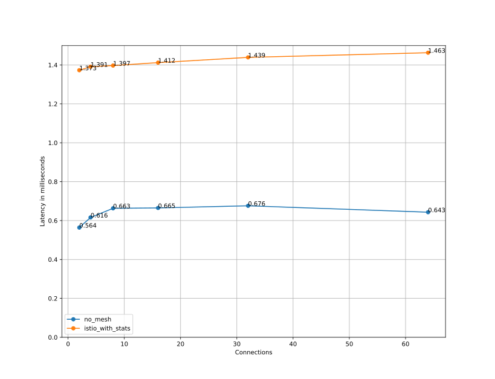

Istio 可以轻松创建具有丰富路由、负载均衡、服务间身份验证、监控等功能的已部署服务网络 - 所有这些都无需对应用程序代码进行任何更改。 Istio 致力于以最小的资源开销提供这些优势，并旨在支持具有高请求率的大型网格，同时增加最小的延迟。

Istio 数据平面组件（Envoy 代理）处理流经系统的数据。 Istio 控制平面组件 Istiod 配置数据平面。数据平面和控制平面具有不同的性能问题。

## Istio 1.18 的性能摘要

[Istio 负载测试](https://github.com/istio/tools/tree/release-1.18/perf/load)网格由 1000 个服务和 2000 个 sidecar 组成，每秒有 70,000 个网格范围的请求。

## 控制平面性能

Istiod 根据用户编写的配置文件和系统的当前状态来配置 sidecar 代理。在 Kubernetes 环境中，自定义资源定义 (CRD) 和部署构成了系统的配置和状态。 Istio 配置对象（例如 Gateway 和 VirtualService）提供用户编写的配置。为了生成代理的配置，Istiod 处理来自 Kubernetes 环境的组合配置和系统状态以及用户编写的配置。

控制平面支持数千个服务，分布在数千个 Pod 中，具有类似数量的用户编写的 VirtualService 和其他配置对象。 Istiod 的 CPU 和内存需求随着配置数量和可能的系统状态而变化。 CPU 消耗与以下因素相关：

- 部署速度发生变化。
- 配置更改的速率。
- 连接到 Istiod 的代理数量。

然而，这部分本质上是水平可扩展的。

启用[命名空间隔离](https://istio.io/latest/docs/reference/config/networking/sidecar/)后，单个 Istiod 实例可以支持 1000 个服务、2000 个 sidecar、1 个 vCPU 和 1.5 GB 内存。您可以增加 Istiod 实例的数量，以减少配置到达所有代理所需的时间。

## 数据平面性能

数据平面性能取决于许多因素，例如：

- 客户端连接数
-  目标请求率
- 请求大小和响应大小
- 代理工作线程数
-  协议
-  CPU核心数
- 代理过滤器的数量和类型，特别是与遥测 v2 相关的过滤器。

延迟、吞吐量以及代理的 CPU 和内存消耗是根据上述因素进行测量的。

### CPU和内存

由于 sidecar 代理在数据路径上执行额外的工作，因此会消耗 CPU 和内存。在 Istio 1.18 中，代理每秒每 1000 个请求消耗大约 0.5 个 vCPU。

代理的内存消耗取决于代理保存的总配置状态。大量的侦听器、集群和路由会增加内存使用量。在启用命名空间隔离的大型命名空间中，代理消耗大约 50 MB 内存。

由于代理通常不会缓冲通过的数据，因此请求速率不会影响内存消耗。

### 延迟

由于 Istio 在数据路径上注入了 sidecar 代理，因此延迟是一个重要的考虑因素。 Istio 添加的每个功能也会增加代理内部的路径长度，并可能影响延迟。

Envoy 代理在响应发送到客户端后收集原始遥测数据。收集请求的原始遥测数据所花费的时间不会影响完成该请求所需的总时间。但是，由于 worker 正忙于处理请求，因此 worker 不会立即开始处理下一个请求。此过程会增加下一个请求的队列等待时间，并影响平均延迟和尾部延迟。实际尾部延迟取决于流量模式。

### Istio 1.18 的延迟

在网格内部，请求先遍历客户端代理，然后遍历服务器端代理。在 Istio 1.18.2 的默认配置中（即带有遥测 v2 的 Istio），两个代理的第 90 个百分位延迟和第 99 个百分位数延迟分别比基准数据平面延迟增加了约 1.7 毫秒和 2.7 毫秒。我们使用 `http/1.1` 协议的 [Istio 基准测试](https://github.com/istio/tools/tree/release-1.18/perf/benchmark)获得了这些结果，使用 16 个客户端连接、2 个代理工作线程并启用了相互 TLS，负载为 1 kB，每秒 1000 个请求。

- `no_mesh` 客户端 pod 直接调用服务器 pod，不存在 sidecar。
- `istio_with_stats` 客户端和服务器 sidecar 均默认配置遥测。这是默认的 Istio 配置。

### 基准测试工具

Istio 使用以下工具进行基准测试：

- `fortio.org` - 恒定吞吐量负载测试工具。
- `nighthawk` - 基于 Envoy 的负载测试工具。
- `isotope` - 具有可配置拓扑的综合应用程序。
