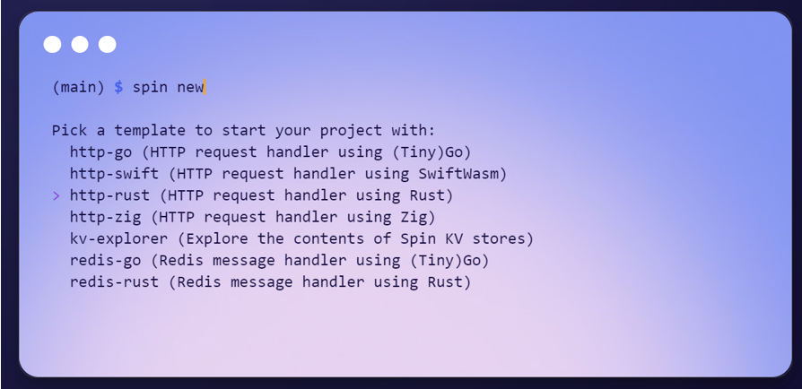

本文译自：[Startup Fermyon Releases Spin 1.0 for WebAssembly Serverless Applications](https://www.notion.so/Startup-Fermyon-Releases-Spin-1-0-for-WebAssembly-Serverless-Applications-4e9b1daa3f8b431193ecd4ea30e40404) 

[Fermyon](https://www.fermyon.com/) 最近宣布推出 [Spin 1.0](https://github.com/fermyon/spin/releases/tag/v1.0.0)，这是一个用于使用 [WebAssembly](https://webassembly.org/) (Wasm) 开发无服务器应用的开源开发者工具和框架。

Spin 1.0 是其去年推出 [介绍](https://www.fermyon.com/blog/introducing-spin) 后的首个稳定版本。在 1.0 版本中，公司增加了对新编程语言（如 JavaScript、TypeScript、Python 或 C#，除了 Rust 和 Go 之外）、连接数据库（[关系型](https://developer.fermyon.com/spin/rdbms-storage) 或 [Redis](https://developer.fermyon.com/spin/redis-outbound)）、使用流行的注册表服务分发应用程序（[GitHub Container Registry](https://ghcr.io/)、[Docker Hub](https://hub.docker.com/) 或 [AWS ECR](https://aws.amazon.com/ecr/)）、内置的 [键值存储](https://developer.fermyon.com/spin/kv-store) 以保持状态、在 Kubernetes 上运行应用程序以及与 [HashiCorp Vault](https://www.hashicorp.com/products/vault) 集成以管理运行时配置等方面的支持。

通过 Spin，该公司为创建运行 Wasm 的应用程序提供了轻松的开发体验，包括部署和安全运行它们的框架。

Fermyon 的首席技术官 [Radu Matei](https://twitter.com/matei_radu) 在一篇 [博客文章](https://www.fermyon.com/blog/introducing-spin-v1) 中解释道：

> Spin 是一个开源的开发者工具和框架，它帮助用户通过创建、构建、分发和运行 Wasm 的无服务器应用程序。我们可以使用 spin new 基于起始模板创建新的应用程序，使用 spin build 将我们的应用程序编译为 Wasm，使用 spin up 在本地运行应用程序。
>
>
> 
>
> *来源：[https://www.fermyon.com/](https://www.fermyon.com/)*

除了在本地运行 spin 应用程序外，开发人员还可以将应用程序部署到 [Fermyon 云](https://www.fermyon.com/cloud)（[去年公开测试版发布](https://www.infoq.com/news/2022/11/Fermyon-cloud-webassembly/)）。在登录 Fermyon Cloud 后，他们可以在存放其应用程序的 spin.[toml 文件](https://toml.io/en/) 所在目录中运行以下命令来部署其应用程序：

**$ spin deploy**

此外，开发人员还可以选择 [将应用程序推送到容器注册表](https://developer.fermyon.com/spin/distributing-apps)。

InfoQ 的一个 [播客](https://www.infoq.com/podcasts/cloud-computing-web-assembly/) 中提到的一个关键点是：

> Spin 是 Fermyon 的一个开源开发者工具，专注于快速迭代的本地开发周期，允许您快速构建基于 WebAssembly 的应用程序，而无需担心部署。Spin 有一个 Visual Studio Code 插件，类似于 AWS Lambda 等无服务器事件监听器模型。

该公司计划在不久的将来使用 [WASI Preview 2](https://github.com/bytecodealliance/preview2-prototyping) 和 [Wasm 组件模型](https://www.fermyon.com/blog/webassembly-component-model)。此外，在 Reddit 的一个 [帖子](https://www.reddit.com/r/WebAssembly/comments/123m4md/introducing_spin_10_the_developer_tool_for/) 中，Matei 回答了一个关于 Web 支持的问题，并提供了未来发展的更多细节：

> 在未来，我们希望允许从 Spin 调用 Wasm 组件，可以在浏览器内或浏览器外使用，但 Spin 的功能旨在用于非浏览器场景。

Fermyon 是众多投资 WASM 技术的公司之一。例如，Docker 最近 [宣布](https://www.docker.com/blog/announcing-dockerwasm-technical-preview-2/) 推出了 Docker+Wasm 的首个 [技术预览版](https://www.docker.com/blog/docker-wasm-technical-preview/)，这是一种独特的构建，使得可以用 WasmEdge 运行时使用 Docker 运行 Wasm 容器。从版本 4.15 开始，每个人都可以通过激活 [containerd image store 实验功能](https://docs.docker.com/desktop/wasm/) 来尝试这些功能。

此外，一个名为 [runwasi 项目](https://github.com/containerd/runwasi) 是 CNCF 的 containerd 生态系统的一部分，允许开发人员通过 Kubernetes 内部的 containerd shim 运行 WebAssembly 运行时。

最后，有关 Spin 的更多详细信息可在 [文档页面](https://developer.fermyon.com/spin/quickstart) 上找到。
