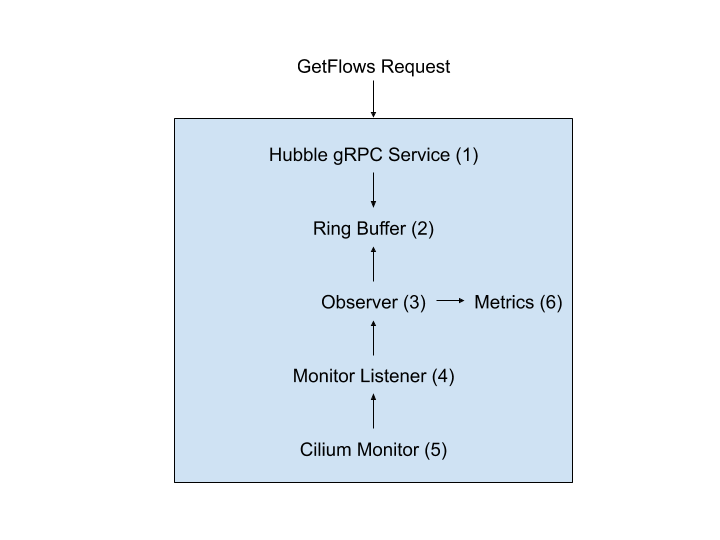

::: {.only}
not (epub or latex or html)

WARNING: You are looking at unreleased Cilium documentation. Please use
the official rendered version released here: <https://docs.cilium.io>
:::

Hubble internals {#hubble_internals}
================

::: {.note}
::: {.title}
Note
:::

This documentation section is targeted at developers who are interested
in contributing to Hubble. For this purpose, it describes Hubble
internals.
:::

::: {.note}
::: {.title}
Note
:::

This documentation covers the Hubble server (sometimes referred as
\"Hubble embedded\") and Hubble Relay components but does not cover the
Hubble UI and CLI.
:::

Hubble builds on top of Cilium and eBPF to enable deep visibility into
the communication and behavior of services as well as the networking
infrastructure in a completely transparent manner. One of the design
goals of Hubble is to achieve all of this at large scale.

Hubble\'s server component is embedded into the Cilium agent in order to
achieve high performance with low-overhead. The gRPC services offered by
Hubble server may be consumed locally via a Unix domain socket or, more
typically, through Hubble Relay. Hubble Relay is a standalone component
which is aware of all Hubble instances and offers full cluster
visibility by connecting to their respective gRPC APIs. This capability
is usually referred to as multi-node. Hubble Relay\'s main goal is to
offer a rich API that can be safely exposed and consumed by the Hubble
UI and CLI.

::: {.note}
::: {.title}
Note
:::

This guide does not cover Hubble in standalone mode, which is deprecated
with the release of Cilium v1.8.
:::

Hubble Architecture
-------------------

Hubble exposes gRPC services from the Cilium process that allows clients
to receive flows and other type of data.

### Hubble server

The Hubble server component implements two gRPC services. The **Observer
service** which may optionally be exposed via a TCP socket in addition
to a local Unix domain socket and the **Peer service**, which is served
on both as well as a Kubernetes Service.

#### The Observer service

The Observer service is the principal service. It provides three RPC
endpoints: `GetFlows`, `GetNodes` and `ServerStatus`. While
`ServerStatus` and `GetNodes` endpoints are pretty straightforward (they
provides metrics and other information related to the running
instance(s)), `GetFlows` is far more sophisticated and the more
important one.

Using `GetFlows`, callers get a stream of payloads. Request parameters
allow callers to specify filters in the form of blacklists and
whitelists to allow for fine-grained filtering of data.

In order to answer `GetFlows` requests, Hubble stores monitoring events
from Cilium\'s event monitor into a user-space ring buffer structure.
Monitoring events are obtained by registering a new listener on Cilium
monitor. The ring buffer is capable of storing a configurable amount of
events in memory. Events are continuously consumed, overriding older
ones once the ring buffer is full.

For efficiency, the internal buffer length is a bit mask of ones + 1.
The most significant bit of this bit mask is the same position of the
most significant bit position of \'n\'. In other terms, the internal
buffer size is always a power of 2 with 1 slot reserved for the writer.
In effect, from a user perspective, the ring buffer capacity is one less
than a power of 2. As the ring buffer is a hot code path, it has been
designed to not employ any locking mechanisms and uses atomic operations
instead. While this approach has performance benefits, it also has the
downsides of being a complex component.

Due to its complex nature, the ring buffer is typically accessed via a
ring reader that abstracts the complexity of this data structure for
reading. The ring reader allows reading one event at the time with
\'previous\' and \'next\' methods but also implements a follow mode
where events are continuously read as they are written to the ring
buffer.

#### The Peer service

The Peer service sends information about Hubble peers in the cluster in
a stream. When the `Notify` method is called, it reports information
about all the peers in the cluster and subsequently sends information
about peers that are updated, added or removed from the cluster. Thus,
it allows the caller to keep track of all Hubble instances and query
their respective gRPC services.

This service is typically only exposed on a local Unix domain socket and
a Kubernetes Service and is primarily used by Hubble Relay in order to
have a cluster-wide view of all Hubble instances.

The Peer service obtains peer change notifications by subscribing to
Cilium\'s node manager. To this end, it internally defines a handler
that implements Cilium\'s datapath node handler interface.

### Hubble Relay {#hubble_relay}

Hubble Relay is the Hubble component that brings multi-node support. It
leverages the Peer service to obtain information about Hubble instances
and consume their gRPC API in order to provide a more rich API that
covers events from across the entire cluster (or even multiple clusters
in a ClusterMesh scenario).

Hubble Relay was first introduced as a technology preview with the
release of Cilium v1.8. It is declared stable with the release of Cilium
v1.9.

Hubble Relay implements the Observer service for multi-node. To that
end, it maintains a persistent connection with every Hubble peer in a
cluster with a peer manager. This component provides callers with the
list of peers. Callers may report when a peer is unreachable, in which
case the peer manager will attempt to reconnect.

As Hubble Relay connects to every node in a cluster, the Hubble server
instances must make their API available (by default on port 4244). By
default, Hubble server endpoints are secured using mutual TLS (mTLS)
when exposed on a TCP port in order to limit access to Hubble Relay
only.
