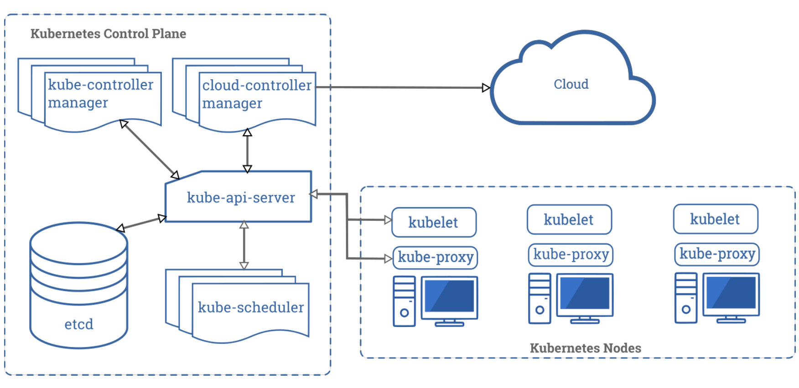

Kubernetes，经常被缩写为 "K8s"，是一个开源的容器或编排系统，用于自动部署、扩展和管理容器化应用程序。它管理着构成集群的所有元素，从应用中的每个微服务到整个集群。与单体软件平台相比，将容器化应用作为微服务使用可以提供更多的灵活性和安全优势，但也可能引入其他复杂因素。

本指南重点关注安全挑战，并尽可能提出适用于国家安全系统和关键基础设施管理员的加固策略。尽管本指南是针对国家安全系统和关键基础设施组织的，但也鼓励联邦和州、地方、部落和领土（SLTT）政府网络的管理员实施所提供的建议。Kubernetes 集群的安全问题可能很复杂，而且经常在利用其错误配置的潜在威胁中被滥用。以下指南提供了具体的安全配置，可以帮助建立更安全的 Kubernetes 集群。

## 建议

每个部分的主要建议摘要如下：

- Kubernetes Pod 安全
  - 使用构建的容器，以非 root 用户身份运行应用程序
  - 在可能的情况下，用不可变的文件系统运行容器
  - 扫描容器镜像，以发现可能存在的漏洞或错误配置
  - 使用 Pod 安全政策来执行最低水平的安全，包括:
    - 防止有特权的容器
    - 拒绝经常被利用来突破的容器功能，如 `hostPID`、`hostIPC`、`hostNetwork`、`allowedHostPath` 等
    - 拒绝以 root 用户身份执行或允许提升为根用户的容器
    - 使用安全服务，如 SELinux®、AppArmor® 和 seccomp，加固应用程序，防止被利用。
- 网络隔离和加固
  - 使用防火墙和基于角色的访问控制（RBAC）锁定对控制平面节点的访问
  - 进一步限制对 Kubernetes etcd 服务器的访问
  - 配置控制平面组件，使用传输层安全（TLS）证书进行认证、加密通信
  - 设置网络策略来隔离资源。不同命名空间的 Pod 和服务仍然可以相互通信，除非执行额外的隔离，如网络策略
  - 将所有凭证和敏感信息放在 Kubernetes Secret 中，而不是配置文件中。使用强大的加密方法对 Secret 进行加密
- 认证和授权
  - 禁用匿名登录（默认启用）
  - 使用强大的用户认证
  - 创建 RBAC 策略以限制管理员、用户和服务账户活动
- 日志审计
  - 启用审计记录（默认为禁用）
  - 在节点、Pod 或容器级故障的情况下，持续保存日志以确保可用性
  - 配置一个 metric logger
- 升级和应用安全实践
  - 立即应用安全补丁和更新
  - 定期进行漏洞扫描和渗透测试
  - 当组件不再需要时，将其从环境中移除

## 架构概述

Kubernetes 使用集群架构。一个 Kubernetes 集群是由一些控制平面和一个或多个物理或虚拟机组成的，称为工作节点。工作者节点承载 Pod，其中包含一个或多个容器。容器是包含软件包及其所有依赖关系的可执行镜像。见图 2：Kubernetes 架构。

控制平面对集群进行决策。这包括调度容器的运行，检测 / 应对故障，并在部署文件中指定的副本数量没有得到满足时启动新的 Pod。以下逻辑组件都是控制平面的一部分：

- **Controller manager（默认端口：10252）** - 监视 Kubernetes 集群，以检测和维护 Kubernetes 环境的几个方面，包括将 Pod 加入到服务中，保持一组 Pod 的正确数量，并对节点的丢失做出反应。
- **Cloud controller manager（默认端口：10258）** - 一个用于基于云的部署的可选组件。云控制器与云服务提供商接口，以管理集群的负载均衡器和虚拟网络。
- **Kubernetes API Server（默认端口：6443 或 8080）** - 管理员操作 Kubernetes 的接口。因此，API 服务器通常暴露在控制平面之外。API 服务器被设计成可扩展的，可能存在于多个控制平面节点上。
- **Etcd（默认端口范围：2379-2380）** - 持久化的备份存储，关于集群状态的所有信息都保存在这里。Etcd 不应该被直接操作，而应该通过 API 服务器来管理。
- **Scheduler（默认端口：10251）** - 跟踪工作节点的状态并决定在哪里运行 Pod。Kube-scheduler 只可以由控制平面内的节点访问。

Kubernetes 工作节点是专门为集群运行容器化应用的物理或虚拟机。除了运行容器引擎外，工作节点还承载以下两个服务，允许从控制平面进行协调：

- **Kubelet（默认端口：10250）** - 在每个工作节点上运行，以协调和验证 Pod 的执行。
- **Kube-proxy** - 一个网络代理，使用主机的数据包过滤能力，确保 Kubernetes 集群中数据包的正确路由。

集群通常使用云服务提供商（CSP）的 Kubernetes 服务或在企业内部托管。在设计 Kubernetes 环境时，组织应了解他们在安全维护集群方面的责任。CSP 管理大部分的 Kubernetes 服务，但组织可能需要处理某些方面，如认证和授权。