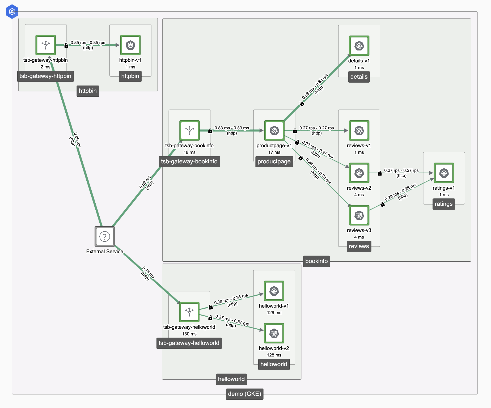

This document describes how to lower the amount of CPU and memory used by the control plane and all the gateways in the mesh by using TSB 
traffic settings which will generate a [sidecar](https://istio.io/latest/docs/reference/config/networking/sidecar/) resource.

## Prerequisites

✓ Familiarize yourself with [TSB concepts](../concepts/).<br />
✓ Install the [TSB demo](../setup/self_managed/demo-installation) environment.<br />
✓ Create a [tenant](../quickstart/tenant).

## Prepare the environment

In this scenario we’re going to deploy three different applications; `bookinfo`, `httpbin` and `helloworld`. Each application will have 
its `ingressgateway` in the same namespace where we will be receiving the traffic and forwarding it to the application. 

Start creating one namespace for each application and enable sidecar injection:

```bash
$ kubectl create ns <ns>
$ kubectl label namespace <ns> istio-injection=enabled
```

Now deploy the applications in each namespace:

```bash
$ kubectl apply -n bookinfo -f https://raw.githubusercontent.com/istio/istio/master/samples/bookinfo/platform/kube/bookinfo.yaml
$ kubectl apply -n helloworld -f https://raw.githubusercontent.com/istio/istio/master/samples/helloworld/helloworld.yaml
$ kubectl apply -n httpbin -f https://raw.githubusercontent.com/istio/istio/master/samples/httpbin/httpbin.yaml
```

And deploy the `ingressgateway` in each namespace:

```bash
$ cat <<EOF | kubectl apply -f -
apiVersion: install.tetrate.io/v1alpha1
kind: IngressGateway
metadata:
  name: tsb-gateway-<ns>
  namespace: <ns>
spec:
  kubeSpec:
    service:
      type: LoadBalancer
EOF
```

You should have three namespaces; `bookinfo`, `httpbin` and `helloworld`. Now create the different workspaces and gateway groups 
to onboard the applications to TSB. You can use this example for `bookinfo` to use it for all the applications:

```bash
$ cat <<EOF | tctl apply -f -
apiVersion: api.tsb.tetrate.io/v2
kind: Workspace
metadata:
 organization: tetrate
 tenant: tetrate
 name: bookinfo
spec:
 namespaceSelector:
   names:
     - "demo/bookinfo"
---
apiVersion: gateway.tsb.tetrate.io/v2
kind: Group
metadata:
 organization: tetrate
 tenant: tetrate
 workspace: bookinfo
 name: bookinfo-gg
spec:
 namespaceSelector:
   names:
     - "demo/bookinfo"
 configMode: BRIDGED
EOF
```

And lastly, apply the `ingressgateways` to generate the gateways and virtual services:

```bash
$ cat <<EOF | tctl apply -f -
apiVersion: gateway.tsb.tetrate.io/v2
kind: IngressGateway
metadata:
 organization: tetrate
 tenant: tetrate
 workspace: httpbin
 group: httpbin-gg
 name: httpbin-gw
spec:
 workloadSelector:
   namespace: httpbin
   labels:
     app: tsb-gateway-httpbin
     istio: ingressgateway
 http:
   - name: httpbin
     port: 80
     hostname: httpbin.tetrate.io
     routing:
       rules:
         - route:
             host: httpbin/httpbin.httpbin.svc.cluster.local
---
apiVersion: gateway.tsb.tetrate.io/v2
kind: IngressGateway
metadata:
 organization: tetrate
 tenant: tetrate
 workspace: helloworld
 group: helloworld-gg
 name: helloworld-gw
spec:
 workloadSelector:
   namespace: helloworld
   labels:
     app: tsb-gateway-helloworld
     istio: ingressgateway
 http:
   - name: helloworld
     port: 80
     hostname: helloworld.tetrate.io
     routing:
       rules:
         - route:
             host: helloworld/helloworld.helloworld.svc.cluster.local
---
apiVersion: gateway.tsb.tetrate.io/v2
kind: IngressGateway
metadata:
 organization: tetrate
 tenant: tetrate
 workspace: bookinfo
 group: bookinfo-gg
 name: bookinfo-gw
spec:
 workloadSelector:
   namespace: bookinfo
   labels:
     app: tsb-gateway-bookinfo
     istio: ingressgateway
 http:
   - name: bookinfo
     port: 80
     hostname: bookinfo.tetrate.io
     routing:
       rules:
         - match:
             - uri:
                 exact: /productpage
             - uri:
                 prefix: /static
             - uri:
                 exact: /login
             - uri:
                 exact: /logout
             - uri:
                 prefix: /api/v1/products
           route:
             host: bookinfo/productpage.bookinfo.svc.cluster.local
             port: 9080
EOF
```

The scenario will look like this:

[](../assets/operations/lower_resources_topology.png)

## Lower control plane and sidecars resources

At this point, all the sidecars are connected and have information about each other. You can get a config dump from istio-proxy 
where you will see all the endpoints that it knows, for this example you can use `helloworld` pod:

```bash
$ kubectl exec <pod> -c istio-proxy -n helloworld -- pilot-agent request GET config_dump > config_dump.json
```

As this is a small scenario, you won’t notice many improvements in CPU and memory resources, but to have an idea about what 
you’ll be doing, you can check the config size. Without any restriction applied, this is the current size:

```bash
$ du -h config_dump.json                                                                                                                                 
2.1M	config_dump.json
```

This is generated by the control plane and sent to all the proxies with the information of all the endpoints. So in order to 
limit the amount of information generated for the gateways, you can select which information a specific gateway needs by using 
the sidecar resource.

As you have three completely different applications which doesn’t communicate with each other, you can create a traffic setting
to allow communication to all the workloads under the same workspace. As the traffic setting is associated to a traffic group,
you'll need to create both resources:

```bash
$ cat <<EOF | tctl apply -f -
apiVersion: traffic.tsb.tetrate.io/v2
kind: Group
metadata:
  organization: tetrate
  tenant: tetrate
  workspace: helloworld
  name: helloworld-tg
spec:
  namespaceSelector:
    names:
      - "demo/helloworld"
  configMode: BRIDGED
---
apiVersion: traffic.tsb.tetrate.io/v2
kind: TrafficSetting
metadata:
  organization: tetrate
  tenant: tetrate
  workspace: helloworld
  group: helloworld-tg
  name: default
spec:
  reachability:
    mode: NAMESPACE
EOF
```

There are multiple reachability modes where you can select all the namespaces in the workspace, or create a custom configuration 
to limit the scope of workloads that the sidecar configuration applies to and hence having an increased granularity. This traffic
setting will create a sidecar resource with the egress field configured, which is used to determine the scope of services the 
workload should be aware of. With this configuration, the control plane will configure the selected workloads to only receive 
configuration on how to reach services in the `helloworld` namespace, instead of pushing configuration for all services in the mesh. 

The configuration size being pushed by the control plane inside of the service mesh reduces its memory and network usage. Now, 
you can get again the config dump and compare the size:

```bash
$ kubectl exec <pod> -c istio-proxy -n helloworld -- pilot-agent request GET config_dump > config_dump.json
$ du -h config_dump.json                                                                                                                                 
1.0M	config_dump.json
```

Note that as currently the sidecar doesn’t have information about other endpoints from the rest of namespaces, it won’t be able to 
reach them, so be careful when applying sidecar configurations. You can see the generated sidecar resource by running:

```bash
$ kubectl get sidecar -n helloworld -o yaml
```

:::note 
For more information about how to improve Istio control plane performance you can read this [blog entry](https://tetrate.io/blog/performance-optimization-for-istio/) 
where this process is explained in detail.
:::
