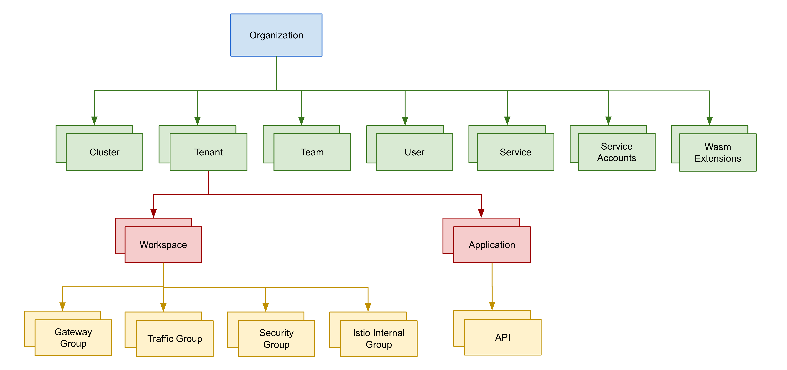
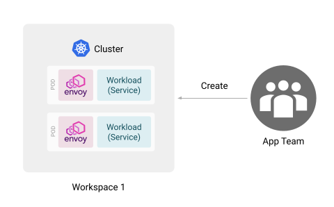
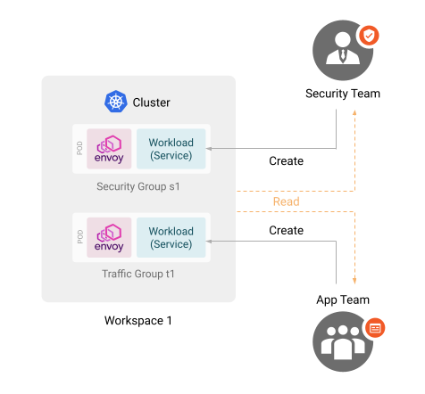

TSB offers a fine grained permissions management to control access to TSB resources. You can grant access permissions to resources such as [Organizations](../../concepts/terminology#organization), [Tenants](../../concepts/terminology#tenant), [Workspaces](../../concepts/terminology#workspace), etc. A collection of permissions can be put into [Roles](../../refs/tsb/rbac/v2/role#role), which can be reused to assign permissions to the appropriate resources, for example users or groups. Once you have defined the Roles, [Access Binding](../../refs/tsb/rbac/v2/yaml) objects can be used to bind Roles to a set of users or teams.

## Resource Model

In order to understand how to work with TSB permissions, you will need to first understand how resources are modeled in TSB.

In TSB resources are modeled as a hierarchical tree, with the Organization being the root for all resources. Organizations contain one or more Clusters, Tenants, Teams, and Users. Tenants contain one or more Workspaces. Finally, Workspaces may contain one or more Gateway Groups, Traffic Groups, and Security Groups.

:::note
In this document, the term Config Groups is used to designate all of Gateway Groups, Traffic Groups, and Security Groups.
:::

[](../../assets/operations/tsb_resources.png)

## Roles

A [Role](../../refs/tsb/rbac/v2/role) is a set of permissions against specific resource(s). For example,  you may create a Role which allows Read/Write permissions to a Workspace, and only Read on its parent Tenant.

Below is a list of permissions that are available:

| Permission (Action) | Description                                               |
|---------------------|-----------------------------------------------------------|
| `Read`              | Allows reading the resource.                              |
| `Write`             | Allows updating the resource.                             |
| `Create`            | Allows creating child resources. [(*1)](#remark-1)        |
| `Delete`            | Allows deleting the resource.                             |
| `SetPolicy`         | Allows delegating control of the resource to other users. |


<a name="remark-1" />(*1) When a user creates child resources, the user is granted ownership of the newly created resources, and thus has complete control over them.

TSB comes with a few builtin Roles with a set of permissions for the most common cases:

| Role    | Read | Write | Create | Delete | SetPolicy |
|---------|:----:|:-----:|:------:|:------:|:---------:|
| Admin   | ✓    | ✓     | ✓      | ✓      | ✓         |
| Editor  | ✓    | ✓     | ✓      |        |           |
| Creator | ✓    |       | ✓      |        |           |
| Writer  | ✓    | ✓     |        |        |           |
| Reader  | ✓    |       |        |        |           |

Both `Admin` and `Editor` roles are intended to give ownership (full control) of a resource tree. But while the `Admin` role is intended for system administrators, the `Editor` role is intended for users or teams who own the resource tree alone.

`Creator` role is intended for users that can create their own resources and see other resources. For example, a user with a `Creator` role may read all resources within a Workspace including resources that were created by others, but has complete ownership of resources that they have created within that Workspace.

By contrast the `Writer` role only allows users to read and modify existing resources, but does not allow creation of new resources.

Finally, the `Reader` role allows users to only read existing resources. They will not be able to do anything else with it.

## Access Bindings 

In TSB, [Access Binding](../../refs/tsb/rbac/v2/access_bindings) objects define the binding between a set of [roles](../../refs/tsb/rbac/v2/role) to a set of users or teams for a specific TSB resource. Example of `AccessBinding` is shown below. You need to use [FQN](#fully-qualified-names) when specifying target resource, role, users and teams.

```yaml
apiVersion: rbac.tsb.tetrate.io/v2
kind: AccessBindings
metadata:
  fqn: organizations/myorg/tenants/mytenant/workspaces/w1
spec:
  allow:
  - role: rbac/admin
    subjects:
    - user: organizations/myorg/users/alice
    - team: organizations/myorg/teams/platform-team
    - serviceAccount: organizations/myorg/serviceaccounts/sa
```

The Roles define the set of permissions against resource(s), and the Access Bindings define the Roles that are associated with a set of users/teams for a particular resource. As team members may be changed dynamically much more easily, in general it is recommended that you assign permissions to teams rather than users, so that you have greater flexibility. 

:::warning 
TSB will **automatically** create an Access Binding object for any of the above resources when a new resource is created. This Access Binding will set whoever user that created the resource as admin.

For example, if you create a Tenant, TSB will create a `AccessBindings` that sets you as the admin for the tenant.

**Do NOT** create new Access Binding if you want to grant permissions to your team because you will overwrite automatically created one. To make sure that you do not accidentally overwrite automatically created Access Bindings, first fetch the target Access Binding `tctl get`, edit the necessary portions, then apply using `tctl apply`
:::

## Fully Qualified Names

In order to unambiguously define a resource, each resource has a fully qualified names (FQN) that that describes their location in the resource hierarchy. These are used in the object definitions that you will be using in the examples.

The following shows the naming patterns used for each of the resources.

| Resource         | FQN |
|----------------  |-----|
| Role             | `rbac/<role name>` |
| Organization     | `organizations/<org name>` |
| Cluster          | `organizations/<org name>/clusters/<cluster name>` |
| Service          | `organizations/<org name>/services/<service name>` |
| Team             | `organizations/<org name>/teams/<team name>` |
| User             | `organizations/<org name>/users/<user name>` |
| Service Account  | `organizations/<org name>/serviceaccounts/<service account name>` |
| WASM Extension   | `organizations/<org name>/extensions/<extension name>` |
| Tenant           | `organizations/<org name>/tenants/<tenant name>` |
| Workspace        | `organizations/<org name>/tenants/<tenant name>/workspaces/<workspace name>` |
| Application      | `organizations/<org name>/tenants/<tenant name>/applications/<application name>` |
| API              | `organizations/<org name>/tenants/<tenant name>/applications/<application name>/apis/<api name>` |
| Gateway Group    | `organizations/<org name>/tenants/<tenant name>/workspaces/<workspace name>/gatewaygroups/<group name>` |
| Security Group   | `organizations/<org name>/tenants/<tenant name>/workspaces/<workspace name>/securitygroups/<group name>` |
| Traffic Group    | `organizations/<org name>/tenants/<tenant name>/workspaces/<workspace name>/trafficgroups/<group name>` |
| Istio Internal Group    | `organizations/<org name>/tenants/<tenant name>/workspaces/<workspace name>/istiointernalgroups/<group name>` |

## Working With Roles and Permissions

When you first install TSB, you will be using the platform administrator account which has super admin privileges. You do not want to let other members of your organization use TSB with this account for obvious reasons. You should either create new users and teams or use the ones imported from your IdP (Identity Provider) e.g LDAP, Azure AD or others.

In this section you will learn about a common scenario assigning roles and permissions to your teams. For demonstration purposes the examples will be executed through the command line using `tctl`, but you can configure TSB through the Web UI just the same.

For this example, please assume that you would like to configure TSB with the following teams and respective settings:

| Team | Description |
|------|-------------|
| Platform Team | Members act as Organization administrators. They can create Tenants, Workspaces, Config Groups, and grant access to these resources to specific teams |
| App Team | Members are able to configure their applications that run in specific namespaces. Specifically, they own a specific Traffic Group in the Workspace that they work on. |
| Security Team | Members are able to read everything under a Tenant, and configure Security Group settings in the Workspaces. |

The example will walk you through how to configure the permissions in iterative steps. You will need to go through all of the steps below to achieve the desired state.

Please assume that the Tenants, Workspaces, Config Groups, Users and Teams that are mentioned in this example have already been created. Also, please note that this is not the only way to achieve the same effect. Certain combinations of roles, permissions, and bindings that satisfy the above will probably exist.

### Notes on Working with Access Bindings

In the examples below, make sure to use _existing_ access binding objects instead of creating new ones. There exists exactly one access binding for each resource. If you create new binding objects, you will effectively be overwriting the existing one, and in most cases you should avoid doing this.

Instead, when you are instructed to edit an access biding in the following examples, make sure to `tctl get` the binding first, make the edit, and then apply it using `tctl apply`.

For example if you are working with organization `AccessBindings`, get the existing bindings first:

```bash{promptUser: alice}
tctl get accessbindings organizations/myorg -o yaml > bindings.yaml
```

Then after you make the edits, apply the bindings:

```bash{promptUser: alice}
tctl apply -f bindings -o yaml > bindings.yaml
```

To get `AccessBindings` for a tenant, you would use `tctl get accessbindings organizations/myorg/tenants/tenant1 -o yaml`. For other resources down in the hierarchy, you will need to provide correct FQN.

### Configuring the Platform Team

As the super admin user you will have to create the Platform team before doing anything. Grant the Platform team with the Admin role on the necessary resources.

In this example the Platform team is given Admin role on the a specific organization `myorg`. Retrieve the organization `AccessBindings` and add the platform team (`orgnizations/myorg/teams/platform`):

```yaml
apiVersion: rbac.tsb.tetrate.io/v2
kind: AccessBindings
metadata:
  fqn: organizations/myorg
spec:
  allow:
  - role: rbac/admin
    subjects:
    - team: organizations/myorg/teams/platform
      ...
```

Apply the above using `tctl apply -f`.

The rest of the examples assume that the above Platform team has prepared all of the necessary resources for the configuration to proceed.

### Configuring for App Team and Workspaces

The app team should be able to view the resources in the `Tenant`, as well be able to create Config Groups within a Workspace, but nothing more. In this and the rest of examples the tenant name is assumed to be `tenant1`.

To grant the team read access to the Tenant, retrieve `AccessBindings` object for the intended tenant, and add the app team as a reader:

```yaml
apiVersion: rbac.tsb.tetrate.io/v2
kind: AccessBindings
metadata:
  fqn: organizations/myorg/tenants/tenant1
spec:
  allow:
  - role: rbac/reader
    subjects:
    - team: organizations/myorg/teams/app
      ...
```

To grant the team create access to the Workspace, retrieve the `AccessBindings` object for the intended workspace, and add the app team as a creator:

```yaml
apiVersion: rbac.tsb.tetrate.io/v2
kind: AccessBindings
metadata:
  fqn: organizations/myorg/tenants/tenant1/workspaces/w1
spec:
  allow:
  - role: rbac/creator
    subjects:
    -  team: organizations/myorg/teams/app
```

Then apply these configurations using `tctl apply -f`.

### Configuring for Security Team and Config Groups

In previous sections it was stated that the App team should only have access to specific Traffic Groups. However, since the previous workspace `AccessBindings` definition granted the Creator role to the App team, [they will be able to create new Config Groups as they please](#roles).

[](../../assets/howto/roles_permissions_app_team.png)

In next scenario the Platform team wants to restrict the App team to own a specific Traffic group that the Platform team has created for them.

Furthermore, the Security team should have similar permissions on a specific Security Group that the Platform team has created.

[](../../assets/howto/roles_permissions_app_security_team.png)

To achieve this, retrieve the `AccessBindings` for the intended tenant again, and add the security team as a reader so that they can read the tenant information. Make sure to leave the app team in there as well.

```yaml
apiVersion: rbac.tsb.tetrate.io/v2
kind: AccessBindings
metadata:
  fqn: organizations/myorg/tenants/tenant1
spec:
  allow:
  - role: rbac/reader
    subjects:
    - team: organizations/myorg/teams/security
    ...
```

Retrieve the `AccessBindings` for the intended workspace again. This time remove the app team from the creator role, and add the app team and the security team as readers of the Workspace.

```yaml
apiVersion: rbac.tsb.tetrate.io/v2
kind: AccessBindings
metadata:
  fqn: organizations/myorg/tenants/tenant1/workspaces/w1
spec:
  allow:
  - role: rbac/reader
    subjects:
    - team: organizations/myorg/teams/app
    - team: organizations/myorg/teams/security
    ...
```

Then retrieve `AccessBindings` for the intended `TrafficGroup`, and add the app team as a creator. The `TrafficGroup` is assumed to have been created by the platform team.

```yaml
apiVersion: rbac.tsb.tetrate.io/v2
kind: AccessBindings
metadata:
  fqn: organizations/myorg/tenants/tenant1/workspaces/w1/trafficgroups/t1
spec:
  allow:
  - role: rbac/creator
    subjects:
    - team: organizations/myorg/teams/app
    ...
```

Similarly retrieve and edit `AccessBindings` for the intended `SecurityGroup`, and add the security team as a creator. The `SecurityGroup` is assumed to have been created by the platform team.

```yaml
apiVersion: rbac.tsb.tetrate.io/v2
kind: AccessBindings
metadata:
  fqn: organizations/myorg/tenants/tenant1/workspaces/w1/securitygroups/s1
spec:
  allow:
  - role: rbac/creator
    subjects:
    - team: organizations/myorg/teams/security
    ...
```

Apply these objects using `tctl apply -f`.

Once everything is successfully applied, you should have TSB in the desired configuration.
