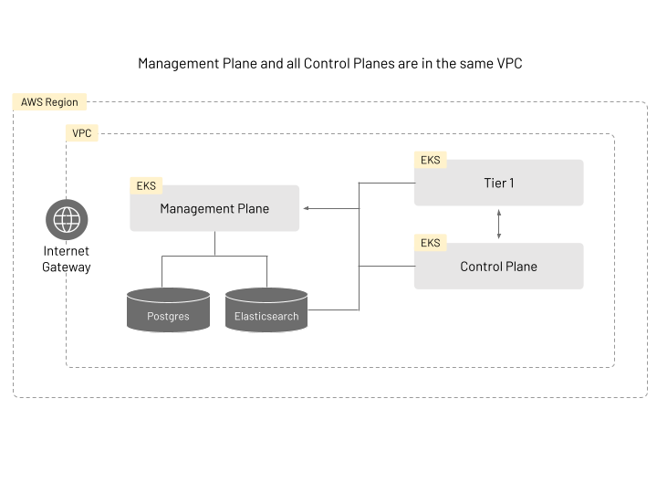
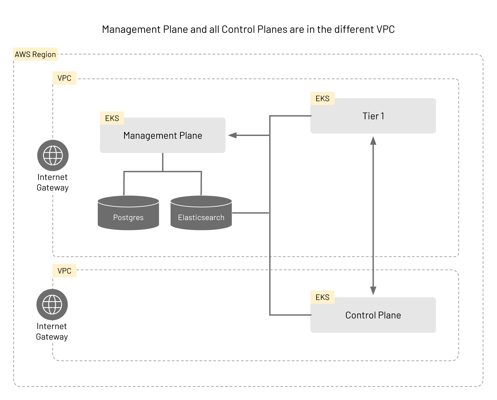

This document describes how to install TSB in AWS in a single VPC.

Before you get started, make sure you: <br />
✓ Familiarize yourself with [TSB concepts](../../concepts/toc) <br />
✓ Install [tctl](../../setup/requirements-and-download#download) and [sync your tctl images](../../reference/cli/reference/install#tctl-install-image-sync)<br />
✓ Install [EKS CLI](https://docs.aws.amazon.com/eks/latest/userguide/eksctl.html)<br />
✓ Install [AWS CLI](https://docs.aws.amazon.com/cli/latest/userguide/getting-started-install.html)

# Installing TSB With A Single VPC

In this scenario, you will need to have 3 EKS clusters, Elasticsearch, and Postgres running in your AWS account. 


Please follow the corresponding AWS guides for more detail on how to setup these:

* [Creating an EKS cluster](https://docs.aws.amazon.com/cli/latest/reference/eks/create-cluster.html)
* [Getting Started with Amazon OpenSearch Service](https://docs.aws.amazon.com/opensearch-service/latest/developerguide/gsgcreate-domain.html) ([CLI reference](https://docs.aws.amazon.com/cli/latest/reference/es/create-elasticsearch-domain.html))
* [Creating a PostgreSQL DB instance](https://docs.aws.amazon.com/AmazonRDS/latest/UserGuide/CHAP_GettingStarted.CreatingConnecting.PostgreSQL.html) ([CLI reference](https://docs.aws.amazon.com/cli/latest/reference/rds/create-db-instance.html))

First, create the Management Plane cluster using the following command template.
Since a VPC is not explicitly defined in the command, a new VPC will be created for you.

```bash{promptUser: alice}
$ eksctl create cluster \
  --name <NAME> \
  --version <VERSION> \
  --region <REGION> \
  --nodegroup-name <POOLNAME> \
  --nodes <NUM> \
  --node-type <TYPE> \
  --managed
```

Once the Management Plane cluster and nodes, as well as VPC, are ready, take note of that sub-VPC names and proceed with the Tier 1 and Control Plane clusters.

For Tier 1 and Control Plane clusters, you will need to specify the VPC network information on top of the previous command template. Use the following command template to create two clusters, one for Tier 1 and one for the Control Plane.

```bash{promptUser: alice}
$ eksctl create cluster \
  --name <NAME> \
  --version <VERSION>\
  --region <REGION> \
  --nodegroup-name <POOLNAME> \
  --nodes <NUM> \
  --node-type <TYPE> \
  --managed \
  --vpc-private-subnets <VPCNAMES> \
  --vpc-public-subnets <VPCNAMES>
```

Once the EKS clusters are ready, make sure to setup OpenSearch and PostgreSQL following the links provided.

## Deploying the Management Plane

Point to the cluster created for Management Plane installation, and follow the instructions in [Management Plane Installation](../../setup/self_managed/management-plane-installation).

However, make sure to specify extra information about Elasticsearch and PostgreSQL.

The user name and password for Elasticsearch and PostgreSQL should be specified when creating Management Plane secrets:

```
$ tctl install manifest management-plane-secrets  \
  --elastic-username <USER> \
  --elastic-password <PASS> \
  --postgres-username <USER> \
  --postgres-password <PASS> \
  ... other options ...
```

Also, the [ManagementPlane](../../refs/install/managementplane/v1alpha1/spec) custom resource should point to the correct PostgreSQL and OpenSearch endpoints:

```yaml
# <snip>
 dataStore:
   postgres:
     address: <postgres-endpoint>
     name: <database-name>
 telemetryStore:
   elastic:
     host: <elastic-endpoint>
     port: <elastic-port>
     version: <elastic-version>
# <snip>
```

Once you have setup the Management Plane, you should be able to obtain the external host name using the following command (make sure to have your kubernetes context pointing to the appropriate cluster):

```bash{promptUser: alice}
$ kubectl get svc -n tsb
```

From the output of the above command you should be able to find a hostname that looks like `ab940458d752c4e0c80830e9eb89a99d-1487971349.<Region>.elb.amazonaws.com`. This is the endpoint that you will use when configuring the Tier 1 and Control Plane configuration YAML files.

## Deploying Tier 1 and Control Plane (Tier2) Clusters

For Tier 1 and CP clusters, follow these instructions:

Check these links for more information regarding the [Tier1 Gateway](../../refs/tsb/gateway/v2/tier1_gateway) and the [Control Plane](../../concepts/operators/control_plane) 

* [Deploy Control Plane operators](../../setup/self_managed/onboarding-clusters#deploy-operators)
* [Install Control Plane secrets](../../setup/self_managed/onboarding-clusters#secrets)
* Apply `ControlPlane` CRs to [install TSB control plane components](../../setup/self_managed/onboarding-clusters#installation)

After you have setup these clusters, add the following annotation to Edge XCP in both Tier 1 and Tier 2 to enable [multi-cluster routing](../../concepts/traffic_management#multi-cluster-routing) and apply the settings.

```yaml
# <snip>
components:
  xcp:
    kubeSpec:
      overlays:
      - apiVersion: install.xcp.tetrate.io/v1alpha1
        kind: EdgeXcp
        name: edge-xcp
        patches:
        - path: spec.components.edgeServer.kubeSpec.overlays
          value:
          - apiVersion: v1
            kind: Service
            name: xcp-edge
            patches:
            - path: spec.type
              value: NodePort
            - path: metadata.annotations
              value:
                traffic.istio.io/nodeSelector: '{"beta.kubernetes.io/arch":"amd64"}'
```

When the clusters are setup, you can follow [the instructions to deploy the bookinfo app](../../quickstart/deploy_sample_app#deploy-bookinfo) to proceed with a demo workload.

# Installing TSB Using Multiple VPCs

For this installation you should have already running [TSB in a single VPC](#installing-tsb-with-a-single-vpc).



The infrastructure in this scenario is similar to that of the case using a single VPC, but the cluster hosting the Control Plane (Tier2) belongs in a different VPC from the clusters for Management Plane and the Tier 1 gateway. The VPCs will need to be configured to be able to communicate with each other. Please read the [guide on VPC peering in AWS](https://docs.aws.amazon.com/vpc/latest/peering/what-is-vpc-peering.html) and the relevant [section in the CLI reference](https://docs.aws.amazon.com/cli/latest/reference/ec2/create-vpc-peering-connection.html) for more details.

First create a cluster and a new VPC for the control plane. You can use the same command template as when you created your first EKS cluster for Single VPC case.

```bash{promptUser: alice}
$ eksctl create cluster \
  --name <NAME> \
  --version <VERSION> \
  --region <REGION> \
  --nodegroup-name <POOLNAME> \
  --nodes <NUM \
  --node-type <TYPE> \
  --managed 
```

## Configuring the VPC

You will need to retrieve VPC information to continue configuring. Use the following command to get the necessary information:

```bash{promptUser: alice}
$ aws ec2 --output text \
          --query 'Vpcs[*].{VpcId:VpcId,Name:Tags[?Key==`Name`].Value|[0],CidrBlock:CidrBlock}' describe-vpcs
```

Find the ID for each VPC that will be participating, and execute [`aws ec2 create-vpc-peering-connection`](https://docs.aws.amazon.com/cli/latest/reference/ec2/create-vpc-peering-connection.html) command to create a VPC peering
to allow the VPCs to talk to each other:

```bash{promptUser: alice}
$ aws ec2 create-vpc-peering-connection \
          --vpc-id <VPC-ID1> \
          --peer-vpc-id <VPC-ID2>
```

Take note the field `VpcPeeringConnectionId` from the output of the above command. You will need this value to accept the peering request.

Using this ID, accept the peering connection using [`aws ec2 accept-vpc-peering-connection`](https://docs.aws.amazon.com/cli/latest/reference/ec2/accept-vpc-peering-connection.html) command:

```bash{promptUser: alice}
$ aws ec2 accept-vpc-peering-connection --vpc-peering-connection-id <PEERID>
```

When the above command is successfully executed, the VPCs should be able to communicate with each other.

## Configuring the Control Plane Cluster

In order to connect to the Control Plane cluster, you will need to update your `kubeconfig`. Run the following command with the appropriate values:

```bash{promptUser: alice}
$ aws eks --region <REGION> update-kubeconfig --name <NAME>
```

The onboard the Control Plane. The general instructions are the same as [Onboarding Clusters guide](../../setup/self_managed/onboarding-clusters).

Your cluster definition for the Control Plane should look like the following. Note the extra fields in the `spec` component.

```yaml
apiVersion: api.tsb.tetrate.io/v2
kind: Cluster
metadata:
  name: cp-remote
  organization: tetrate
spec:
  displayName: "Control Plane Remote"
  network: tier2
```

When you are [ready to install the Control Plane Custom Resources](../../setup/self_managed/onboarding-clusters#installation), modify the definition from the guide and set appropriate values using the following YAML as a guide:

```yaml
apiVersion: install.tetrate.io/v1alpha1
kind: ControlPlane
metadata:
  name: controlplane
  namespace: istio-system
spec:
  hub: <repository>
dataStore:
  postgres:
    address: <postgres-endpoint>
    name: <database-name>
  telemetryStore:
    elastic:
      host: <elastic-endpoint>
      port: <elastic-port>
      version: <elastic-version>
  managementPlane:
    host: <management-plane-endpoint>
    port: 8443
    clusterName: <management-plane-cluster>
  components:
    internalCertProvider:
      certManager:
        managed: INTERNAL
    xcp:
      kubeSpec:
        overlays:
        - apiVersion: install.xcp.tetrate.io/v1alpha1
          kind: EdgeXcp
          name: edge-xcp
          patches:
          - path: spec.components.edgeServer.kubeSpec.overlays
            value:
            - apiVersion: v1
              kind: Service
              name: xcp-edge
              patches:
              - path: spec.type
                value: NodePort
              - path: metadata.annotations
                value:
                  traffic.istio.io/nodeSelector: '{"beta.kubernetes.io/arch":"amd64"}'
```

If everything is configured correctly, you should be able to deploy workloads on the new cluster.
